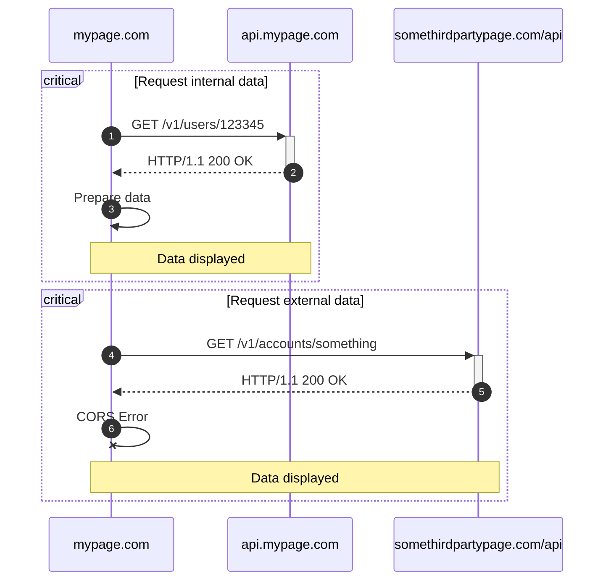

You are learning how to build a full-stack, micro-service application. You have
a beautiful front-end app. You build a sophisticated REST API. Now, you want to
connect the two together to create a seamless experience for your users.
However, you run into a problem. Your front-end app is blocked from accessing
the results from your REST API requests. This is the notorious CORS error.

{/* Excerpt */}

# What is CORS?

Cross-Origin Resource Sharing (CORS) is a security feature implemented by
default in most modern web browser. The idea is to prevent requests made to
different origins from happening.

A common scenario in web developmentn is when a web page makes a request to a
different domain, whether it is a subdomain, a different port, different scheme,
or a completely different third-party domain. This is considered a cross-origin
request.

## Why requests

## Same-origin policy

