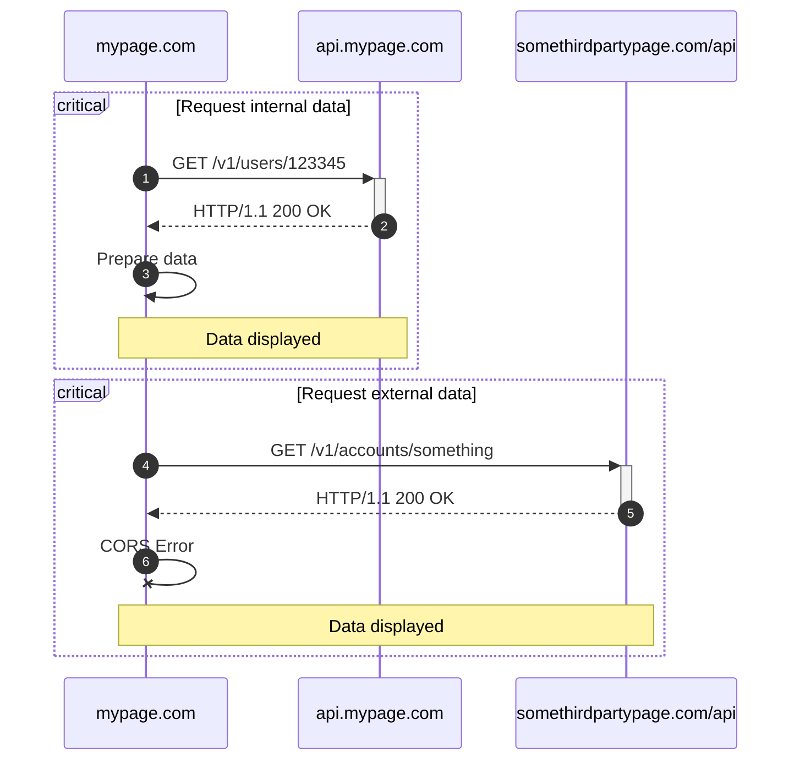
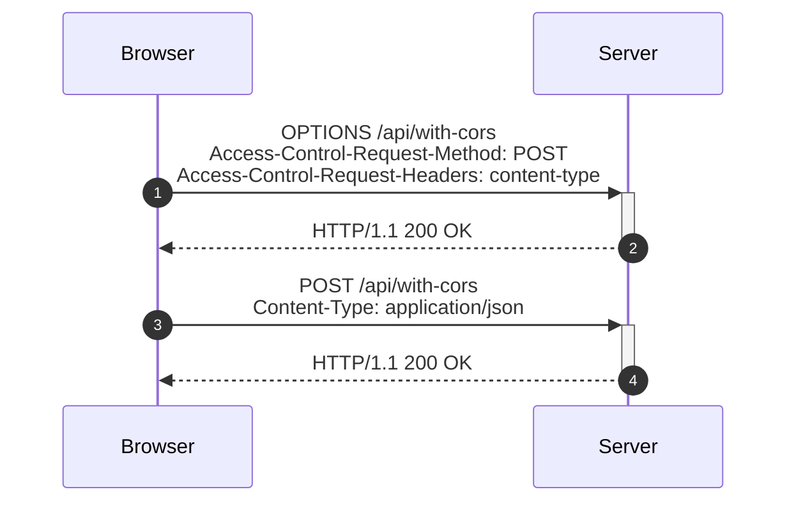

You are learning how to build a full-stack, micro-service application. You have
a beautiful front-end app. You build a sophisticated REST API. Now, you want to
connect the two together to create a seamless experience for your users.
However, you run into a problem. Your front-end app is blocked from accessing
the results from your REST API requests. This is the notorious CORS error.

{/* Excerpt */}

# What is CORS?

By default, browsers block cross-origin requests that are made to different origins. Cross-Origin Resource Sharing (CORS) is a mechanism that allows servers to relax the Same-Origin Policy (SOP) and allow requests from different origins to be read by the script making the request.

A common scenario in web development is when a web page makes a request to a
different domain, whether it is a subdomain, a different port, different scheme,
or a completely different third-party domain. This is considered a cross-origin
request.



## Why cross-origin requests are blocked?

There is a common attack in web security called Cross-Site Request Forgery
(CSRF) attack. CSRF forces an end user to perform unwanted actions on a web
application in which they are currently authenticated. Via social engineering
techniques (such as sending a link via email or chat), the attacker tricks the
user into executing actions of the attacker's choosing.

Browsers, by default, block cross-origin requests to prevent a malicious script
loaded from one origin from interacting with resources from a different origin.
This makes it difficult for attackes to make unauthorized requests silently to
a different origin. This is called the [Same-Origin Policy](
https://developer.mozilla.org/en-US/docs/Web/Security/Same-origin_policy).

## Same-origin policy

In the Same-Origin Policy, SOP, the requests can still be made to the different
origins. However, the browser will block the response from being read and
executed by the script.

For example, an authenticated user on `mypage.com` visits a malicious website
with a similar name, `myppage.com`. The malicious website has the same layout
and content as the original site the user usually visits. However, the attacker
sneaks in a script that makes requests to `mypage.com` to read user data such as
user id, email and other sensitive information.

SOP prevents this from happening by blocking the response from `mypage.com` from
being read by the script on `myppage.com`. The requests are still made to the
original server but by preventing the response from being read, the attacker
cannot steal the user's data.


## So why CORS?

CORS is a way to relax the strict, by-default SOP in modern browsers. It allows
responses from different origins to be read by the script making the request.
In other words, CORS is how the original server says, _"I'm okay with sharing
this data with you."_, either to all origins or to a specific list of origins.

# How to enable CORS?

As we know, CORS is a server-side feature that enables the browser to relax the
Same-Origin Policy. In order to enable CORS, the server must include the proper
headers in the response. The browser will then check these headers to determine
if the response can be read.

## Raw headers

In order to enable CORS, origin servers must include the header
`Access-Control-Allow-Origin` in the response. This header can be set to `*`,
`<origin>` or `null`.

- `*` means the response can be read by any origin.
- `<origin>` means the response can be read by the specified origin.
- `null` means the response cannot be read by any origin.

<Callout type="warning" title="Avoid returning null">

W3C recommends against returning `null` as it can cause unexpected behavior in
some browsers[^1]. Allowing `null` as an origin can be risky because it permits
requests from `file://` URLs, which can be used to read local files.

If a site wants to be publicly accessible, it should return `*`. Otherwise,
specify an origin in the header.

</Callout>

CORS also allows other headers to be included in the response to fine-tune the
access control. These headers include:

- `Access-Control-Allow-Methods`: Specifies the methods allowed when accessing
  the resource.
- `Access-Control-Allow-Headers`: Specifies the headers allowed when accessing
  the resource.
- `Access-Control-Allow-Credentials`: Specifies whether credentials are allowed
  when accessing the resource.
- `Access-Control-Expose-Headers`: Specifies the headers that can be exposed to
  the requesting client.
- `Access-Control-Max-Age`: Specifies how long the results of a preflight
  request can be cached.

## How to set it up?

Now that we know how to enable CORS, including the headers in the response is
fairly easy since most web frameworks and libraries allow you to set some
headers manually. For example, in ExpressJS, you can set the headers like this:

```js
apiRouter.get("/with-cors", (req, res) => {
  res.header("Access-Control-Allow-Origin", "*"); // Other specific origin
  // Other CORS headers

  // Handle the request
  res.json({ message: "Hello, CORS!" });
});
```

In Flask (Python), you can set the headers like this:

```py
@app.route("/with-cors")
def with_cors():
    response.headers["Access-Control-Allow-Origin"] = "*"
    # Other CORS headers

    return jsonify({"message": "Hello, CORS!"})
```

However, setting the headers manually can be cumbersome, and if not careful, it
might lead to security vulnerabilities. Lucky for us, there are many libraries
and middlewares that can handle CORS perfectly. Here are some suggestions
depending on the language and framework you are using:

- ExpressJS: [cors](https://www.npmjs.com/package/cors)
- Flask: [Flask-CORS](https://flask-cors.readthedocs.io/en/latest/)
- Spring Boot: [Spring CORS](https://spring.io/guides/gs/rest-service-cors/)
- Go: [Gorilla Handlers](https://github.com/gorilla/handlers)

# Preflight requests

As mentioned above, SOP still allows requests to be made to different origins.
However, when the request is a non-simpple request, the browser will send a
CORS preflight request to the server to determine if the server is CORS-aware
and the actual request can be made.

## Simple and non-simple requests

But first, we need to understand what simple and non-simple requests are. A
simple request is a request that __meets all the following conditions__:

- The request method is `GET`, `HEAD`, or `POST`.
- The standard headers are set by the browser, user agent or [the Fetch spec](
  https://fetch.spec.whatwg.org/#forbidden-header-name). Or, the headers are
  CORS-safelist headers. A full list of CORS-safelist headers can be found
  [here](https://developer.mozilla.org/en-US/docs/Glossary/Forbidden_header_name).
- The `Content-Type` header is one of the following:
  - `application/x-www-form-urlencoded`
  - `multipart/form-data`
  - `text/plain`

If the request does not meet these conditions, it is considered a non-simple.
For example:

- A request with `PUT` or `DELETE` method.
- A request with custom headers such as `X-Request-Id`.
- A request with `Content-Type` of `application/json`, which is mostly the case
  for REST APIs.

## So what is a preflight request?

A preflight request is an HTTP request that the browser sends to determine if
the origin server is CORS-aware and if the actual request can be made. A
preflight request is an `OPTIONS` request that includes the `Origin` header and
the `Access-Control-Request-Method` header. For example:

```http
OPTIONS /api/with-cors HTTP/1.1
Host: localhost:8989
User-Agent: Mozilla/5.0 (X11; Linux x86_64; rv:134.0) Gecko/20100101 Firefox/134.0
Accept: */*
Access-Control-Request-Method: POST
Access-Control-Request-Headers: content-type
Referer: http://localhost:5173/
Origin: http://localhost:5173
Connection: keep-alive
```

If the server is CORS-aware, it should respond with the proper CORS headers and
a `200 OK` status code. For example:

```http
HTTP/1.1 200 OK
X-Powered-By: Express
Access-Control-Allow-Origin: *
Access-Control-Allow-Headers: Content-Type
Access-Control-Allow-Methods: GET, POST, PUT, DELETE, HEAD
Date: Mon, 27 Jan 2025 00:11:05 GMT
Connection: keep-alive
Keep-Alive: timeout=5
Content-Length: 0
```

When the browser receives the proper CORS headers, it will fire the intended
request:

```http
POST /api/with-cors HTTP/1.1
Host: localhost:8989
User-Agent: Mozilla/5.0 (X11; Linux x86_64; rv:134.0) Gecko/20100101 Firefox/134.0
Accept: */*
Referer: http://localhost:5173/
Content-Type: application/json
Content-Length: 25
Origin: http://localhost:5173
Connection: keep-alive
```

A sequence diagram of a preflight request can be illustrated as follows:



You don't typically write preflight requests manually from the client-side apps.
The browser, based on the criteria of a simple or non-simple request, will
determine if a preflight request is needed.

However, from the server-side perspective, you need to handle the preflight
requests properly. Most CORS libraries and middlewares will handle the preflight
requests, either by default or with fine-grained configurations. For example,
with `Flask-CORS`:

```py
@app.route("/", methods=['GET'])
@cross_origin()
def helloWorld():
    return '''<h1>Hello CORS!</h1> Read about my spec at the
<a href="http://www.w3.org/TR/cors/">W3</a> Or, checkout my documentation
on <a href="https://github.com/corydolphin/flask-cors">Github</a>'''


@app.route("/api/v1/users/create", methods=['GET', 'POST'])
@cross_origin(allow_headers=['Content-Type'])
def cross_origin_json_post():
    return jsonify(success=True)

if __name__ == "__main__":
    app.run(debug=True)
```

# Misconceptions about CORS

CORS is a great feature that allows browsers to communicate with different
origins. However, there are some misconceptions about CORS that you should be
aware of:

- __CORS is a security feature__: CORS is not a security feature. It is a
  mechanism to relax the Same-Origin Policy. It is up to the server to prevent
  the unauthorized access to the resources while the SOP prevents the browser
  from reading the response.
- __CORS prevents CSRF attacks__: CORS does not prevent CSRF attacks. It is
  still possible to perform CSRF attacks even with CORS enabled. It is up to the
  server to implement CSRF protection mechanisms such as CSRF tokens, `SameSite`
  cookies, and `Referer` header checks.
- __CORS is only for APIs__: CORS is not only for APIs. It is for any resource
  that is requested from a different origin. This includes images, fonts,
  scripts, and stylesheets.
- __CORS is only for browsers__: CORS is a browser feature. However, it is not
  limited to browsers. Any client that makes HTTP requests can be affected by
  CORS. This includes mobile apps, desktop apps, and server-to-server
  communication.
- __CORS is a headache__: CORS can be a headache if not implemented properly.
  At the core, CORS uses a very minimum set of headers to enforce the access
  control. It gets even easier with the help of libraries, middlewares or
  built-in features in modern web frameworks.

# Conclusion

CORS is a great feature that allows browsers to relax the strictness of the
Same-Origin Policy. It enables servers to specify which origins can access the
resources, which methods are allowed and which headers should be in use. CORS is
also simple to implement, either through libraries or by setting the headers
manually. However, it is recommended to use libraries or middlewares to handle
CORS to prevent security vulnerabilities and to make the implementation easier.

How about you? How do you implement CORS in your apps? Please let me know what
you think.

# References

[^1]: [W3C Recommendation](https://w3c.github.io/webappsec-cors-for-developers/#avoid-returning-access-control-allow-origin-null)
