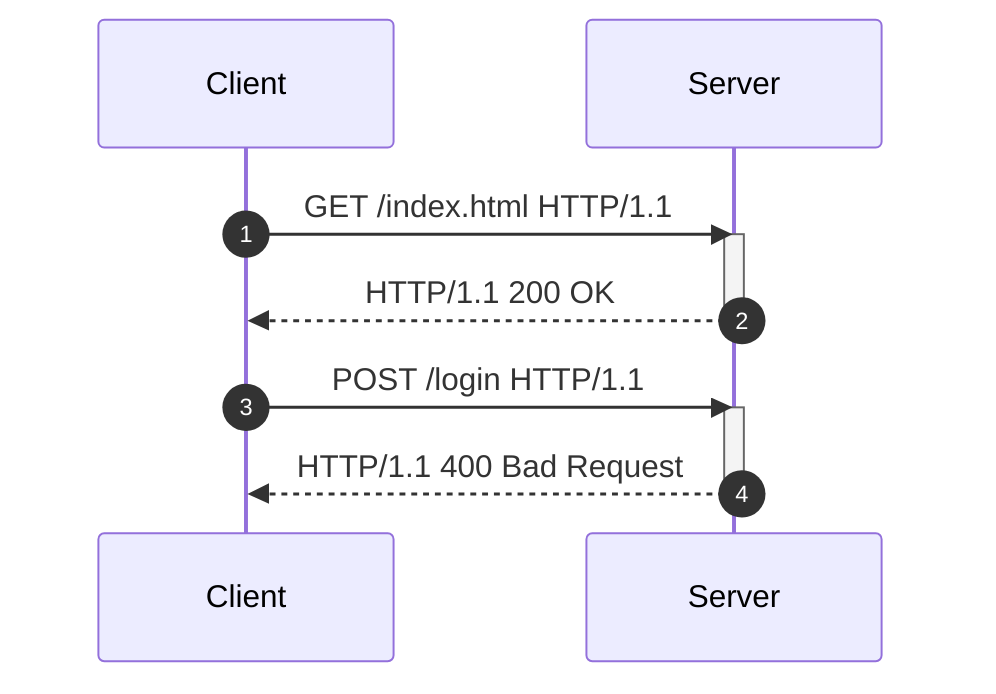
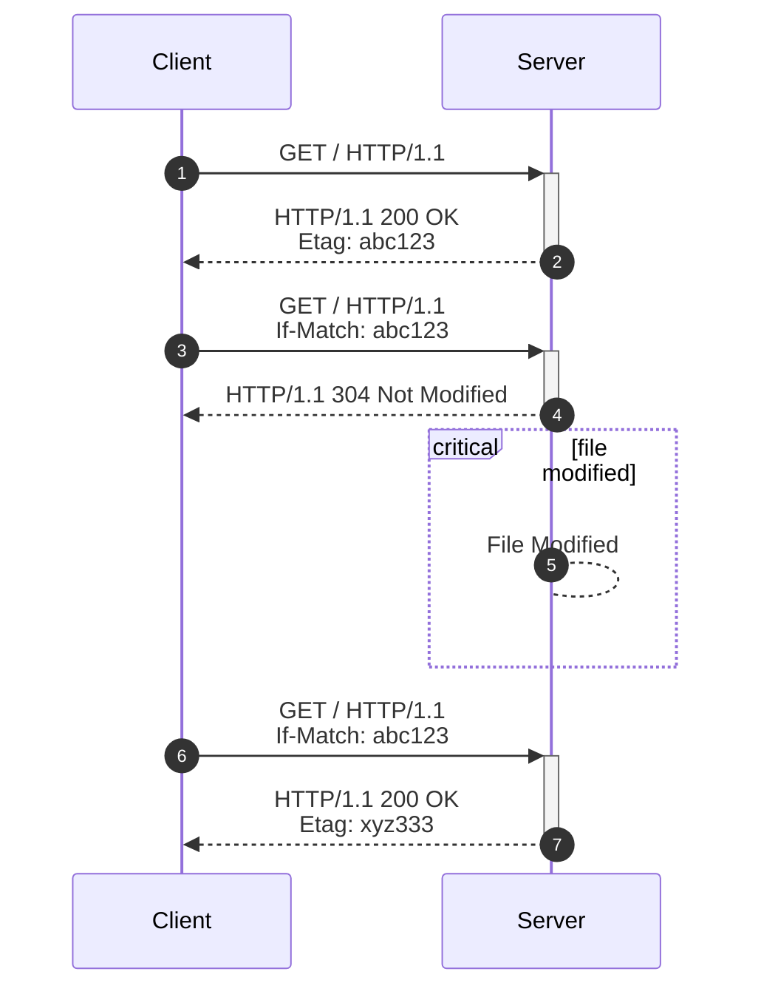
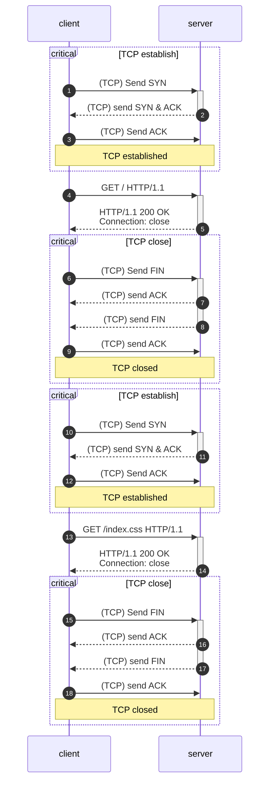
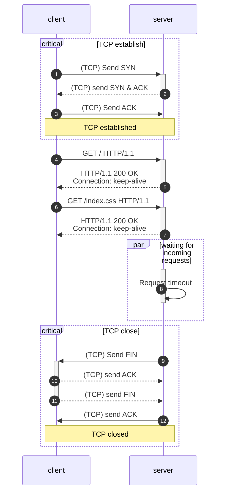
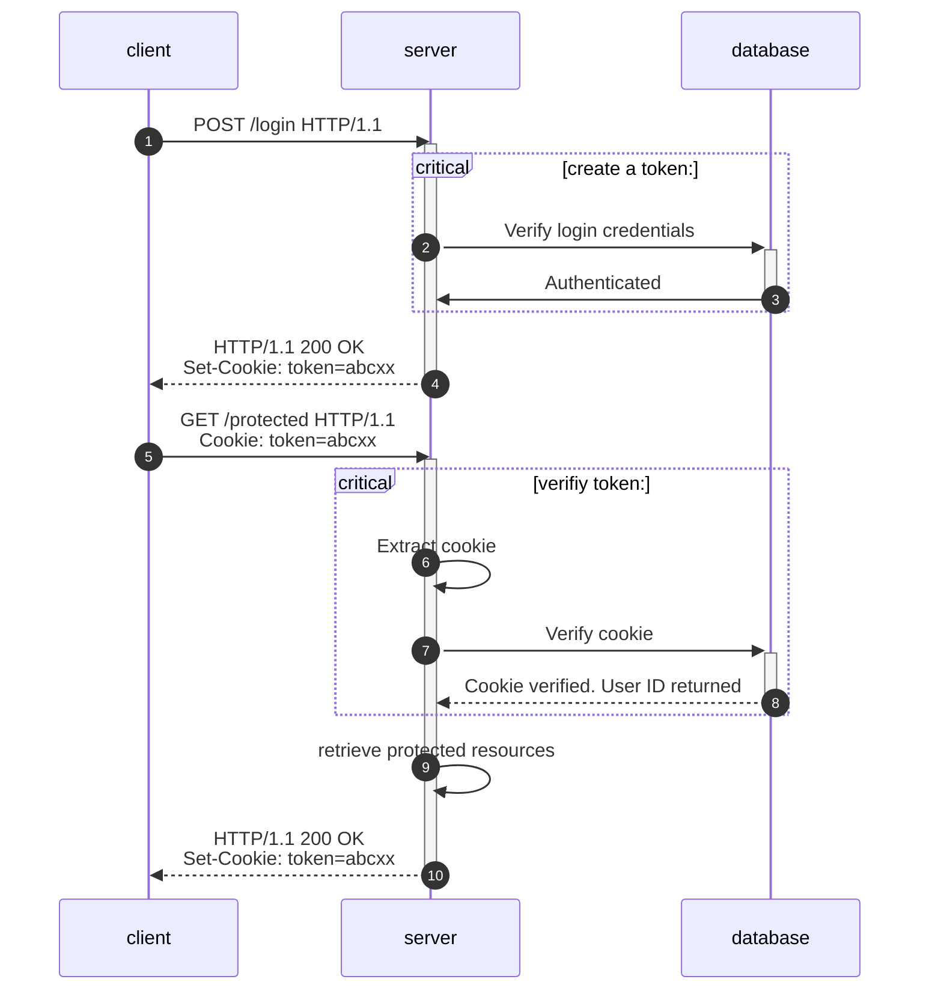
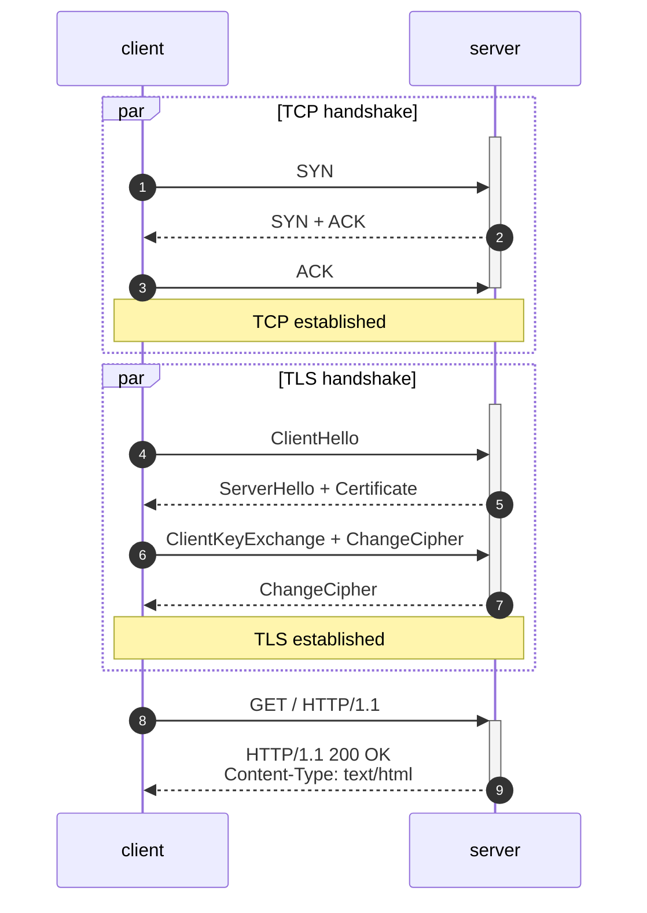

HTTP is the protocol that powers the modern web. It is the foundation of data
exchange in the internet. From text files like HTML, CSS fils to images and
videos, everything is transferred over HTTP.

{/* EXCERPT */}

# Introduction

HTTP stands for _HyperText Transfer Protocol_. HTTP was defined in [RFC 1945](
https://datatracker.ietf.org/doc/html/rfc1945) and [RFC 2616](
https://datatracker.ietf.org/doc/html/rfc2616) for HTTP/1.0 and HTTP/1.1
respectively. HTTP has been the backbone of our modern web and internet
communication.

HTTP involves two components: a client and a server. The client is an active
component that initializes the communication whereas the server is a passive
component that waits for incoming communication. They talk to each other using
HTTP messages. HTTP defines the structure of these messages to indicate which
one is a request sent by clients, and which one is a response sent by servers.




# HTTP Message

As mentioned above, HTTP messages are used to communicate between clients and
servers in the HTTP protocol. There are two types of messages: request and
response. A request message is sent by the client to a target server to request
certain resouces. A response message is sent by the server to the client to tell
the client the result of the request.

HTTP messages are not some special data structure or complex format. They are
basically text messages or strings that have certain structure and format. It
will unify the communication between different systems and platforms, and help
the servers know how to parse the message and respond to it.

Both requests and responses share the same structure. They consist of three
parts: a start line, a header section and an optional body. However, requests
and responses have different content in the start line and require different
headers to indicate the purpose of the message. The message body is optional and
can be empty. Here is the general structure of an HTTP message defined in [RFC
2616](https://datatracker.ietf.org/doc/html/rfc2616#section-5.2)

```txt disableCopyButton
generic-message   = start-line
                    *(message-header CRLF)
                    CRLF
                    [ message-body ]

start-line          = Request-Line | Status-Line

message-header      = field-name ":" [ field-value ]
field-name          = token
field-value         = *( field-content | LWS )
field-content       = <the OCTETs making up the field-value
                      and consisting of either *TEXT or combinations
                      of token, separators, and quoted-string>

message-body        = entity-body
                    | <entity-body encoded as per Transfer-Encoding>

```

## HTTP Request

HTTP Request message is defined in [RFC 2616 Section 5.2](
https://datatracker.ietf.org/doc/html/rfc2616#section-5.2).

```txt disableCopyButton
Request         = Request-Line
                  *(( general-header
                    | request-header
                    | entity-header ) CRLF)
                  CRLF
                  [ message-body ]

Request-Line          = Method SP Request-URI SP HTTP-Version CRLF

Method                = "OPTIONS"
                      | "GET"
                      | "HEAD"
                      | "POST"
                      | "PUT"
                      | "DELETE"
                      | "TRACE"
                      | "CONNECT"

Request-URI           = "*" | absoluteURI | abs_path | authority

HTTP-Version          = "HTTP" "/" ( "1.0" | "1.1"  | "2" )

general-header        = Cache-Control
                      | Connection
                      | Date
                      | Pragma
                      | Trailer
                      | Transfer-Encoding
                      | Upgrade
                      | Via
                      | Warning

request-header        = Accept
                      | Accept-Charset
                      | Accept-Encoding
                      | Accept-Language
                      | Authorization
                      | Expect
                      | From
                      | Host
                      | If-Match
                      | If-Modified-Since
                      | If-None-Match
                      | If-Range
                      | If-Unmodified-Since
                      | Max-Forwards
                      | Proxy-Authorization
                      | Range
                      | Referer
                      | TE
                      | User-Agent

entity-header         = [ unknown-header ]
```

A typical HTTP request message from a browser to a server might look like this:


```http disableCopyButton
GET /blogs/how-http-works HTTP/2
Host: www.richardhnguyen.com
User-Agent: Mozilla/5.0 (X11; Linux x86_64; rv:133.0) Gecko/20100101 Firefox/133.0
Accept: text/html,application/xhtml+xml,application/xml;q=0.9,*/*;q=0.8
Accept-Language: en-US,en;q=0.5
Accept-Encoding: gzip, deflate, br, zstd
Connection: keep-alive
Upgrade-Insecure-Requests: 1
Sec-Fetch-Dest: document
Sec-Fetch-Mode: navigate
Sec-Fetch-Site: cross-site
Priority: u=0, i
Pragma: no-cache
Cache-Control: no-cache
TE: trailers
```

The first line of the request message is called the _request line_. It contains
3 parts:

- The request method (`GET` in this case) is used to tell the server what action
  the client wants to perform. There are several request methods in HTTP such as
  `GET`, `POST`, `PUT`, `DELETE`, etc.
- The URI (`/index.html`) is the path to the resource that the client wants to
  access. Depending on the request method, the server might perform different
  actions on the resource.
- The HTTP version (`HTTP/1.1`) is the version of the HTTP protocol that the
  client is using. Different versions of the HTTP protocol might have different
  features and formats. For simplicity, HTTP/1.1 is the main focus of this post.


The header section contains additional information about the request and the
client itself. The usage of the headers is versatile. They can be used to
request the resource with specific conditions. However, there are some that are
required in order to make the request valid. For example, the `Host` header is
required in HTTP/1.1 to indicate the target server.

Clients can include as many headers as they want to provide necessary
information to the server. Then, how does  the server know when the header
section ends? The answer is the empty line (`\r\n`). The empty line indicates
the end of the header section and the beginning of the body section.

The final part of the request message is the body. The body is optional, which
means that some requests might have no body at all. For example, a `GET` request
usually has no body because it is used to retrieve resources from the server.
However, a `POST` request usually has a body because it is used to send data to
the server.

## HTTP Response

HTTP Response message is defined in [RFC 2616 Section 6](https://datatracker.ietf.org/doc/html/rfc2616#section-6).

```txt disableCopyButton
Response      = Status-Line
                *(( general-header
                | response-header
                | entity-header ) CRLF)
                CRLF
                [ message-body ]

Status-Line = HTTP-Version SP Status-Code SP Reason-Phrase CRLF

Status-Code    =  "100"  ; Continue
                | "101"  ; Switching Protocols
                | "200"  ; OK
                | "201"  ; Created
                | "202"  ; Accepted
                | "203"  ; Non-Authoritative Information
                | "204"  ; No Content
                | "205"  ; Reset Content
                | "206"  ; Partial Content
                | "300"  ; Multiple Choices
                | "301"  ; Moved Permanently
                | "302"  ; Found
                | "303"  ; See Other
                | "304"  ; Not Modified
                | "305"  ; Use Proxy
                | "307"  ; Temporary Redirect
                | "400"  ; Bad Request
                | "401"  ; Unauthorized
                | "402"  ; Payment Required
                | "403"  ; Forbidden
                | "404"  ; Not Found
                | "405"  ; Method Not Allowed
                | "406"  ; Not Acceptable
                | "407"  ; Proxy Authentication Required
                | "408"  ; Request Time-out
                | "409"  ; Conflict
                | "410"  ; Gone
                | "411"  ; Length Required
                | "412"  ; Precondition Failed
                | "413"  ; Request Entity Too Large
                | "414"  ; Request-URI Too Large
                | "415"  ; Unsupported Media Type
                | "416"  ; Requested range not satisfiable
                | "417"  ; Expectation Failed
                | "500"  ; Internal Server Error
                | "501"  ; Not Implemented
                | "502"  ; Bad Gateway
                | "503"  ; Service Unavailable
                | "504"  ; Gateway Time-out
                | "505"  ; HTTP Version not supported
                | extension-code

extension-code  = 3DIGIT
Reason-Phrase   = *<TEXT, excluding CR, LF>

response-header = Accept-Ranges
                | Age
                | ETag
                | Location
                | Proxy-Authenticate
                | Retry-After
                | Server
                | Vary
                | WWW-Authenticate
```

A typical HTTP response message from a server to a client looks like this:

```http disableCopyButton
HTTP/1.1 200 OK
Accept-Ranges: bytes
Access-Control-Allow-Origin: *
Age: 68438
Cache-Control: public, max-age=0, must-revalidate
Content-Disposition: inline
Content-Length: 161639
Content-Type: text/html; charset=utf-8
Date: Thu, 12 Dec 2024 20:07:37 GMT
Etag: "e170d7e754287d0891883f2f5b2fdc8c"
Server: Vercel
Strict-Transport-Security: max-age=63072000
Vary: RSC, www.Router-State-Tree, www.Router-Prefetch
X-Matched-Path: /
X-Vercel-Cache: HIT
X-Vercel-Id: pdx1::w995t-1734034056964-51f61c3fde64

[ HTML content ]
```

In HTTP response message, the first line is called the _status line_. It
contains 3 parts:

- The HTTP version (`HTTP/1.1`) is the version of the HTTP protocol that the
  server is using. It should be the same as the client's version.
- The status code (`200`) is a 3-digit number that indicates the result of the
  request. There are many status codes in HTTP, but the most common ones are
  `200` (OK), `404` (Not Found), `500` (Internal Server Error), etc.
- The reason phrase (`OK`) is a human-readable description of the status code.
  It is not used by clients to determine the result of the request, but it is
  useful for debugging and logging purposes.

  <Callout title="Reason phrase in later versions" type="info">

  The reason phrase is removed from later versions of the HTTP protocol, HTTP/2
  and HTTP/3. The status code is deemed enough to indicate the result of the
  request.

  </Callout>

The header section are basically the same as in the request message. They
contains some general headers and some specific headers that are used for the
response. These headers are used to provide additional information about the
response so that clients can understand and handle the response properly.

However, there are some headers that are important for the response to be
handled properly. For example, the `Content-Type` header is required to tell
the client what type of content the response contains. For example, browsers
use this header to determine how to display the content of a response. If the
`Content-Type` header is `text/html`, the browser will render the content as
an HTML page. However, if the `Content-Type` header is set to `text/plain`, the
browser will render the content as plain text.

Another important header is the `Content-Length` header. This header is used to
tell the client the length of the response body in bytes. As we mentioned above,
the body section of the response is optional and there is no way for the client
to stop reading the response body. The client will keep reading the response
and cause a blocking issue. Therefore, the `Content-Length` header is used to
tell the client how many bytes it should read from the response body. After
reading the specified number of bytes, the client will stop reading the response
body.

The value in `Content-Length` header should match the actual length of the body.
If the value is less than the actual length, the client will stop reading the
body prematurely and make the response incomplete. If the value is greater than
the actual length, the client will keep reading the body and cause a blocking
issue as it expects more data to come.

<Callout type="info" title="Chunked transfer coding" collapsible>

In some cases, the server might not know the length of the response body in
advance. For example, when the server generates the response dynamically or
streams the response to the client. In this case, the server can use the
`Transfer-Encoding: chunked` header to indicate that the response body is
transferred in chunks. Each chunk is prefixed with the length of the chunk in
hexadecimal format followed by a CRLF (`\r\n`). The last chunk has a length of
`0` and is followed by an empty line (`\r\n`). The client reads the chunks
until it reads the last chunk with a length of `0`. [RFC 2616 Section 3.6.1](
https://datatracker.ietf.org/doc/html/rfc2616#section-3.6.1) defines the
mechanism in detail.

</Callout>

# HTTP methods

HTTP defines several request methods that clients can use to interact with a
resource location in different ways. For example, a `GET` request to `/login`
URI means to retrieve the login page from the server but a `POST` request to
the same `/login` URI means to send the login credentials that the user wishes
to use to log in.

## `GET` method

The `GET` method is used to retrieve resources from the server; whatever the
server wants to return to the client. It can be an HTML page, an image, a video
or a JSON object.

A `GET` can be also a conditional request when the header section includes these
headers

- `If-Modified-Since` & `If-Unmodified-Since`: The server will return the
  resource only if it has been modified or not modified respectively since the
  specified date.
- `If-Match` & `If-None-Match`: The server will return the resource only if the
  entity tag matches or does not match the specified entity tag respectively.
- `If-Range`: The server will return the resource only if the entity tag matches
  the specified entity tag or the range matches the specified range.

The purpose of these headers is to allow efficient updates of cached information
with a minimum amount of data transfer.

For example, a client initially sends a `GET` request to retrieve the index page
of a blog. The server returns the page with a `Last-Modified` header and an
`ETag` header. The client will cache these headers and the content of the body
locally. On sequential requests, the client will include the `If-Modified-Since`
or `If-Match` header to check if the resource has been updated. If the server
verifies and finds that the resource has not been updated, it will return a
`304 Not Modified` response with no body. The response implies that the client
can use the cached body to render the page.



## `POST` method

The `POST` method is mainly used to create a new resource on the server. The
origin server accepts the entity enclosed in the request as a new subordinate of
the resource identified by the request URI.

`POST` requests contain a body that describes the entity closed in the request.
The server will use the body to create a new resource. Same as responses with a
body, `POST` requests should include the `Content-Length` header to indicate the
length of the body. The server will read the body until it reaches the specified
length.

`POST` requests should only include the `Content-Type` header to indicate the
type of the body. Its purpose is for the server to know how to parse the body
and store it in an appropriate data structure. For example, `POST` data from a
form will have the `Content-Type: application/x-www-form-urlencoded` header.
Origin servers can use this header to parse the body, extract the form data and
store it for efficient access. Or in REST servers, `POST` data are often in JSON
format, so the `Content-Type: application/json` header is used to tell the
origin server to parse the body as a JSON object.

If a new resource is created, the origin server should return a `201 Created`
status code in the response and include a `Location` header to indicate the URI
of the newly created resource. The client can use the URI to access the newly
created resource.

## `PUT` method

The `PUT` method is also used to send data to the server. With the Request URI,
the server should store the enclosed entity under the supplied Request URI. If
the Request URI refers to an already existing resource, the enclosed entity
should be considered as a modified version of the resource.

`PUT` requests are idempotent, which means that multiple identical requests
should have the same effect as a single request. For example, if a client sends
a `PUT` request to create a new resource, the server should create the resource
and return a `201 Created` status code. If the client sends the same `PUT`
request again, the server should return a `200 OK` status code because the
resource has already been created.

> The fundamental difference between the `POST` and `PUT` requests is
> reflected in the different meaning of the `Request-URI`. The URI in a
> `POST` request identifies the resource that will handle the enclosed
> entity. That resource might be a data-accepting process, a gateway to
> some other protocol, or a separate entity that accepts annotations.
> In contrast, the URI in a `PUT` request identifies the entity enclosed
> with the request -- the user agent knows what URI is intended and the
> server MUST NOT attempt to apply the request to some other resource.
> If the server desires that the request be applied to a different URI,
>
> -- <cite>RFC 2616 Section 9.5[^1]</cite>

To illustrate this difference, `POST` requests means that you let server decide
which resouce to be handled with the enclosed entity. On the other hand, `PUT`
requests means that you tell the server which resource specifically to be
handled with the enclosed entity.

For example, a typical `POST` request to a `/users` URI means that you let the
server decide how to create with the enclosed entity:

```http disableCopyButton
POST /users HTTP/1.1
Content-Type: application/json
Content-Length: 100
Connection: close

{
  "fullName": "John Doe",
  "email": "johndoe@gmail.com",
  "userName": "johndoe",
  "password": "a_secret_password",
  "role": "user",
  "verified": false
}
```

The URI `/users` is ambiguous. It does not specify which user to create and lets
the server decide how to create the user. The result of a successful request can
result with a username, `/users/johndoe`, or a user ID generated by the
server, `/users/123456`.

On the other hand, a typical `PUT` request to a `/users/johndoe` URI means that
you tell the server to create a user with the enclosed entity under the `/users`
URI:

```http disableCopyButton
PUT /users/johndoe HTTP/1.1
Content-Type: application/json
Content-Length: 80
Connection: close

{
  "fullName": "John Doe",
  "email": "johndoe@gmail.com",
  "password": "a_secret_password",
  "role": "user",
  "verified": false
}
```

If the user at the URI `/users/johndoe` does not exist, the server should create
a new one with the enclosed entity. If the user already exists, the server
should update the user with the same data, depending on how the server is
implemented.

## `DELETE` method

The `DELETE` method is used to remove a resouce identified by the Request URI
from the server. Same as `PUT` requests, `DELETE` requests tell the server
which resource specifically to be removed. For example,

```http disableCopyButton
DELETE /users/johndoe HTTP/1.1
Connection: close
```

## `HEAD` method

The `HEAD` method is pretty much identical to the `GET` method, but instead of
returning the complete response with status line, headers and body, the server
only returns the status line and headers, and omits the body in the response.

`HEAD` requests are often used to chec the status of the resource without
transferring the entire  body. It's useful in testing, validity, accessibility,
and recent modification of the resource.

The response to `HEAD` requests are identical to the response to `GET` requests
except that the body is omitted. That includes the status line and headers. For
example:

```http title="HEAD request" disableCopyButton
HEAD / HTTP/1.1
Host: www.washington.edu
```

```http title="Response" disableCopyButton
HTTP/1.1 200 OK
date: Fri, 13 Dec 2024 00:36:01 GMT
server: Apache
upgrade: h2
connection: Upgrade
last-modified: Thu, 12 Dec 2024 17:30:07 GMT
etag: "12eeb-6291610c14c89"
accept-ranges: bytes
content-length: 77547
content-type: text/html

```

## `OPTIONS` method

The `OPTIONS` method is used to describe the communication options for the target resource. In other words, `OPTIONS` requests are used to ask the server what methods are allowed on the target resource before sending the actual requests.

`OPTIONS` requests are often used in cross-origin requests to check if the
server allows requests with certain methods, certain headers and from certain
origins.

For example, a client wants to know if a `POST` request is allowed on a
resource. The client will send an `OPTIONS` request to the server to check if
the server allows `POST` requests on the resource.

```http disableCopyButton
OPTIONS / HTTP/1.1
Host: www.example.com
```

Typically, the server will respond a `200 OK` or `204 No Content` status code
with the `Allow`[^2] header to in the response to indicate which methods are
allowed on the resource.

```http disableCopyButton
HTTP/1.1 200 OK
Allow: OPTIONS, GET, HEAD, POST
Cache-Control: max-age=604800
Content-Type: text/html; charset=UTF-8
Date: Fri, 13 Dec 2024 05:39:01 GMT
Expires: Fri, 20 Dec 2024 05:39:01 GMT
Server: EOS (vny/044F)
Content-Length: 0
```

In the response, `example.com` allows `OPTIONS`, `GET`, `HEAD`, and `POST`.
Therefore, a `POST` request can be made to the resource.

In modern web servers, the `Allow` header is usually replaced by the
`Access-Control-Allow-Methods` header. The `Access-Control-Allow-Methods` header
is used in cross-origin requests (CORS)[^3]. It tells the client which methods
are allowed on the resource in the target origins. For example, if an `OPTIONS`
request is made to this blog page:

```http disableCopyButton
OPTIONS /blogs/how-http-works HTTP/1.1
Host: www.richardhnguyen.com
```

The server will respond with the `Access-Control-Allow-Methods` header to tell
the client which methods are allowed on the resource in the target origin.

```http disableCopyButton
HTTP/1.1 204 No Content
Access-Control-Allow-Methods: OPTIONS, GET, HEAD
Access-Control-Allow-Origin: *
Age: 0
Cache-Control: public, max-age=0, must-revalidate
Content-Disposition: inline
Date: Fri, 13 Dec 2024 05:46:18 GMT
Server: Vercel
Strict-Transport-Security: max-age=63072000
[ ... other headers]

```

## `TRACE` and `CONNECT` methods

The last two methods, `TRACE` and `CONNECT`, are less common and are used mainly
for debugging and proxy purposes. `TRACE` requests allow clients to see what is
being received tat the other end of the request chain.

```http disableCopyButton
TRACE / HTTP/1.1
Host: www.example.com
```

The server will respond with the same request that the client sent. The response
is useful for debugging purposes to see if the request is being modified by
intermediate proxies or servers.

```http disableCopyButton
HTTP/1.1 200 OK
Content-Type: message/http
Content-Length: 100
Connection: close

TRACE / HTTP/1.1
Host: www.example.com
[ ... other headers]
```

However, the `TRACE` method is considered a security risk because it can expose
sensitive information to attackers. Therefore, it is disabled by default in most
browsers and servers.

The `CONNECT` method is used to establish a tunnel to the server identified by
the target resource. Upon successful connection, the client and the server can
blindly send data to each other.

# HTTP Status Codes

HTTP status codes are 3-digit numbers that indicate the result of the request.
There are 5 classes of status codes in HTTP status codes

- `1xx`: Informational - Request received, continuing process
- `2xx`: Success - The action was successfully received, understood, and accepted
- `3xx`: Redirection - Further action must be taken in order to complete the request
- `4xx`: Client Error - The request contains bad syntax or cannot be fulfilled
- `5xx`: Server Error - The server failed to fulfill an apparently valid request

## `1xx` Informational

`1xx` status codes are used to indicate that the server has received the request
and is processing it. The client should continue with the request. There are
several `1xx` status codes in HTTP, but the most common ones are:

- `100 Continue`: The server has received the request headers and the client
  should proceed with the request. The server will send a final response after
  the request body is received.
- `101 Switching Protocols`: The server is changing protocols. The client should
  switch to the new protocol and continue with the request.

## `2xx` Success

`2xx` status codes are the most common status codes in HTTP. They indicate that
the request was successfully processed by the server. There are some common `2xx` status codes:

- `200 OK`: The request was successful and the server has returned the requested
  resource.
- `201 Created`: The request was successful and the server has created a new
  resource.
- `204 No Content`: The request was successful but the server has not returned
  any content in the response body.
- `206 Partial Content`: The server has returned only part of the requested
  resource. This status code is used in response to `Range` requests.

## `3xx` Redirection

`3xx` status codes are used to indicate that the client must take additional
action to complete the request. There are several `3xx` status codes in HTTP,
but the most common ones are:

- `301 Moved Permanently`: The requested resource has been permanently moved to
  a new location. The client should update its bookmarks and links to the new
  location.
- `302 Found`: The requested resource has been temporarily moved to a new
  location. The client should use the new location for this request only.
- `304 Not Modified`: The requested resource has not been modified since the
  last request. The client can use the cached version of the resource.

## `4xx` Client Error

`4xx` status codes are used to indicate that there was an error in the request
made by the client. The purpose of these status codes is to inform the client
that the request was not valid. It could be due to invalid syntax, missing
headers, unauthorized access, or other reasons. Basically, the errors are caused
by the client and the server refuses to process the request further.

Some common `4xx` status codes are:

- `400 Bad Request`: The request was invalid and the server cannot process it.
- `401 Unauthorized`: The client must authenticate itself to get the requested
  resource.
- `403 Forbidden`: The client does not have permission to access the requested
  resource.
- `404 Not Found`: The requested resource was not found on the server.
- `405 Method Not Allowed`: The request method is not allowed for the requested
  resource.
- `408 Request Timeout`: The server timed out while waiting for the request.

`4xx` status codes are sometimes implmenented in detail by the server to
indicate the exact error. However, if the error is not specific, the server
can return a `400 Bad Request` status code for general client errors.

## `5xx` Server Error

`5xx` status codes are used to indicate that there was an error on the server
side while processing the request. The purpose of these status codes is to inform the client that the request was valid but the server failed to process it. It could be due to server overload, server crash, server misconfiguration, or other reasons. Basically, the errors are caused by the server and the client should try the request again later.

Some common `5xx` status codes are:

- `500 Internal Server Error`: The server encountered an unexpected condition
  that prevented it from fulfilling the request.
- `501 Not Implemented`: The server does not support the functionality required
  to fulfill the request.
- `502 Bad Gateway`: The server received an invalid response from an upstream
  server while processing the request.
- `503 Service Unavailable`: The server is currently unavailable due to
  overload or maintenance.
- `504 Gateway Timeout`: The server did not receive a timely response from an
  upstream server while processing the request.


## `501` and `405` Status Code

The `501 Not Implemented` status code is used to indicate that the server does
not support the functionality required to fulfill the request. For example, if a
client sends a `PATCH` request to a server that does not support the `PATCH`
method, the server should return a `501 Not Implemented` status code.

The `405 Method Not Allowed` status code is used to indicate that the request
method is not allowed for the requested resource. For example, if a client sends
a `POST` request to a resource that only allows `GET` requests, the server should return a `405 Method Not Allowed` status code.

## `401` and `403` Status Code

The `401 Unauthorized` status code is used to indicate that the client must
authenticate itself to get the requested resource. Maybe the client has not
included a cookie or an authorization header in the request. The client
should retry the request with the proper credentials.

The `403 Forbidden` status code is used to indicate that the client understood
the request but refused to fulfill it.

# HTTP Persistent Connections

From many example HTTP messages above, you might notice that clients and servers
often send the header `Connection` in HTTP messages. If sent by the client with
the value `keep-alive`, it requests the server to keep the connection open. If
send by the server with the value `keep-alive`, it indicates that the server
agrees to keep the connection open. This is called a _persistent connection_.
However, if the value is `close`, it indicates that the server will close the
connection after sending the response. The client should establish a new
connection if it wishes to send new data. This is called a _non-persistent
connection_.

Persistent connections are based on the underlying TCP connection. When a client
sends a request to a server, it establishes a TCP connection to the server. The
The process of establishing a TCP connection is expensive because it involves
many steps such as the TCP handshake, the TLS handshake and the teardown. In
reality, the process can be even more complex.

Therefore, persistent connections are used to reduce the overhead of
establishing. This is the main different between HTTP/1.0 and HTTP/1.1. In HTTP/
1.0, the default behavior is to close the connection after sending the
response. In HTTP/1.1, the default behavior is to keep the connection open
unless the server sends a `Connection: close` header.



In the example above, for every request, the client has to establish a new TCP
connection to the server. After successfully receiving a response, both client
and server close thhe connection. The process repeats for every request.



The example above shows how persistent connections reduce the overhead of TCP
connections. By keeping the connection open, the client can send multiple
requests using the same TCP connection. Unless there is a timeout or the server
sends a `Connection: close` header explicitly, the connection will be kept open.

In later version of the HTTP protocol, HTTP/2 and HTTP/3, persistent connections
are handled differently. Therefore, the `Connection` header is not used. In
fact, it is prohibited:

> HTTP/3 does not use the Connection header field to indicate connection-
> specific fields; in this protocol, connection-specific metadata is conveyed
> by other means. An endpoint MUST NOT generate an HTTP/3 field section
> containing connection-specific fields; any message containing connection-
> specific fields MUST be treated as malformed.
>
> -- <cite>RFC 9114[^4]</cite>

# Stateless and Stateful HTTP

By default, HTTP is a stateless protocol. It means that each request is handled
separately and independently. The server does not keep track of the state of
the client between requests. Therefore, each client request is required to put
some information in the request to identify itself.

For example, when a client successfully logs in to a website, the server
provides some authorization token to the client. The client must send the token
in every subsequent request to access protected resources. The server does not
keep track of the client's login state. If the client loses the token, it must
log in again to get a new one.

But them the question is that how does the server send the token and how does
the client send it back in subsequent requests? The answer is Cookie 🍪.

Let's take a look at the following simple authentication:



Upon a successful login, the server sends a `Set-Cookie` header in the response
to the client. The `Set-Cookie` header will tell the client's browser to store
the cookie with the name `token` and the value `abcxx`. The client's browser
will automatically include the cookie with the header `Cookie` in subsequent
requests to the server. The server will extract the cookie from the header and
verify it with the database. If the cookie is valid, the server will return the
protected resources to the client.

Modern web applications also use different methods to maintain the state of the
client. Some will use the `Authorization` header to send the token back to the
server.  Some servers send the authorization token in the body of the response
and the client will store it in a local storage. With this method, developers
on client apps need to manually include the token in the `Authorization` header.

# HTTP over TLS

Transport Layer Security (TLS) is a cryptographic protocol that provides a
secure communication channel betweem two parties over the Internet. It is
primarily used to encrypt the data exchange in HTTP messages between web
applications and servers. A HTTP message over TLS is called HTTPS. HTTPS is
set up on top of TCP and below the application layer.



What TLS provides:

- **Encryption**: hides the exchanged data from third parties.
- **Authentication**: ensures that the data is sent and received by the
  intended parties.
- **Integrity**: ensures that the data is not tampered with during the
  transmission.

In a nutshell, HTTPS provides a secure communication channel in which only the
end sender and the end receiver can read the data. Even if the data travel
across the Internet, it is encrypted and cannot be read by third parties.
Without HTTPS, third parties such as Internet Service Providers (ISPs),
gateways and eavesdroppers can read the data and potentially steal sensitive
information.

<Callout type="info" title="Port for HTTP and HTTPS">

HTTP servers can be configured to listen on many different port numbers as long
as they are valid and not in use. However, the default port number for HTTP and
HTTPS are `80` and `443` respectively. When a client sends a request to a server
without specifying the port number, the default port number is used based on the
the scheme of the URI. For example, if a client sends a request to `http://www.example.com`. The default port number is `80`. If the client sends a request to `https://www.example.com`, the default port number is `443`.

</Callout>

# Conclusion

HTTP has been the backbone of our modern web applications and the main protocol
for communication between clients and servers. By defining a set of rules or
formats of messages, HTTP allows clients and servers to transfer data over the
Internet. That includes texts, images, videos, or hyperlinks. By learning the
basic concepts of HTTP, you can understand how HTTP works under the hood in a
basic level.

You can follow my GitHub repository, [richardnguyen99/http-from-scratch](
https://github.com/richardnguyen99/http-from-scratch), to learn more about
building your own HTTP server from scratch in C++ without using any third-party
HTTP libraries.

HTTP also has many advanced and complex features that are used to solve some
common problems in HTTP. For more details, you can refer to my other posts:

- [Cross-Origin Resource Sharing (CORS)](https://www.richardhnguyen.com/blogs/cors-in-different-ways)
- [Web caching](https://www.richardhnguyen.com/blogs/web-caching)
- [So you would like some cookies](https://www.richardhnguyen.com/blogs/how-http-works)
- [head-of-line blocking: Differences between HTTP/1.1, HTTP/2 and HTTP/3](https://www.richardhnguyen.com/blogs/head-of-line-blocking)


# References

[^1]: https://datatracker.ietf.org/doc/html/rfc2616#section-9.5
[^2]: https://datatracker.ietf.org/doc/html/rfc2616#section-14.7
[^3]: https://datatracker.ietf.org/doc/html/rfc7480#section-5.6
[^4]: https://datatracker.ietf.org/doc/html/rfc9114#section-4.2


