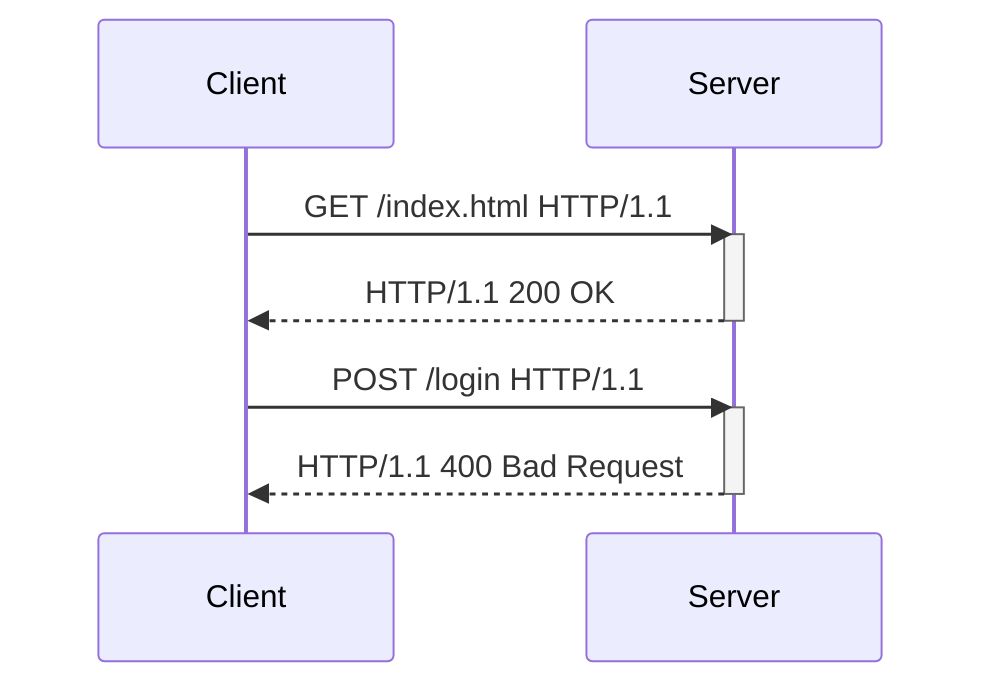

HTTP is the protocol that powers the modern web. It is the foundation of data
exchange in the internet. From text files like HTML, CSS fils to images and
videos, everything is transferred over HTTP.

{/* EXCERPT */}

# Introduction

HTTP stands for _HyperText Transfer Protocol_. HTTP was defined in [RFC 1945](
https://datatracker.ietf.org/doc/html/rfc1945) and [RFC 2616](
https://datatracker.ietf.org/doc/html/rfc2616) for HTTP/1.0 and HTTP/1.1
respectively. HTTP has been the backbone of our modern web and internet
communication.

HTTP involves two components: a client and a server. The client is an active
component that initializes the communication whereas the server is a passive
component that waits for incoming communication. They talk to each other using
HTTP messages. HTTP defines the structure of these messages to indicate which
one is a request sent by clients, and which one is a response sent by servers.

