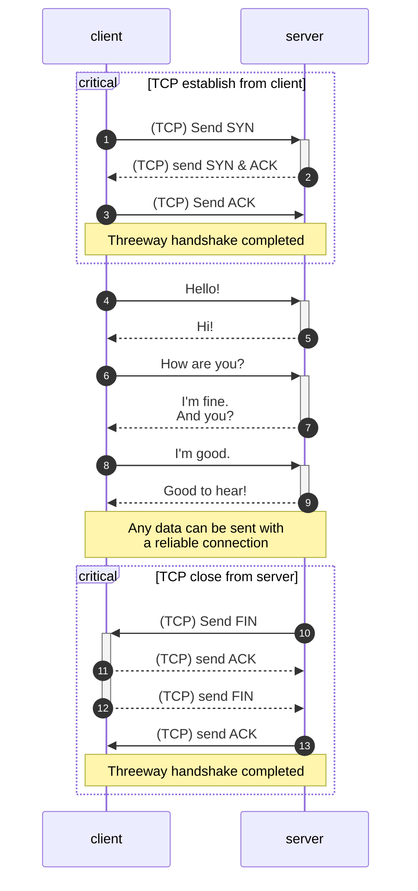
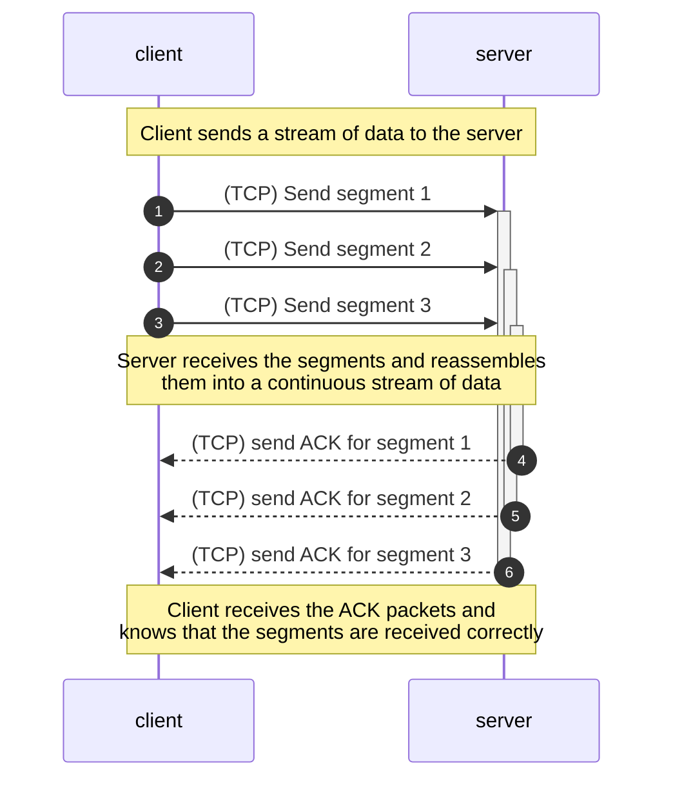
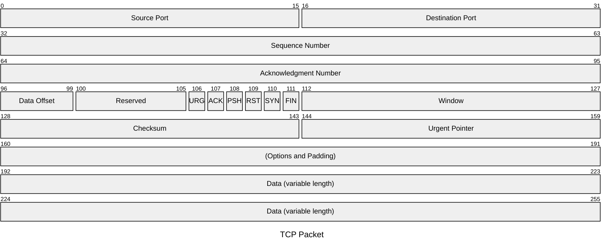

Transmission Control Protocol (TCP) is one of the core protocols of the
Internet Protocol Suite. TCP provides reliable, ordered, and error-checked
delivery of content between two endpoints. It is the backbone of the Internet
and is used by many applications like web browsing, email, and file transfer.

{/* EXCERPT */}

# Introduction

TCP is one of the standard network protocols that define our modern Internet.
85% of total Internet traffic is TCP traffic[^1], while the rest is UDP traffic.
It was developed in the 1970s by
[Vint Cerf](https://www.internethalloffame.org/vint-cerf/) and
[Robert Kahn](https://www.internethalloffame.org/inductee/robert-kahn/)
to buildd a reliable client-server communication using
[packet-switching](https://ethw.org/Packet_Switching).

> Packet switching is a method of data transmission in which data is broken into
> small packets and sent over a network. Instead of establishing a dedicated
> connection line between two hosts, packet switching allows smaller packets to
> be sent independently on multiple routes and reassembled at the destination.

TCP is a connection-oriented, reliable, and stream-oriented protocol. It
provides many mechanisms to ensure the reliability of data transmission such as
error detection, retransmission, duplication, flow controls and congestion
controls.

Most of TCP applications are web-based applications like HTTP (HTTP/1.1 and
HTTP/2), HTTPS, FTP and SMTP, which are basically the protocols that run servers
and applications used by billions of people globally.

# What is TCP?

TCP is a protocol in the Transport Layer of the Internet Protocol Suite. The job
of the Transport Layer is to provide a logical communication between _application processes_. Transport Layer is implemented on top of the Network
Layer and below the Application Layer.

TCP and UDP are the two most common transport protocols. They are both
implemented by the operating systems in the endpoint devices such as computers,
smartphones, and servers whereas the Network Layer is implemented by the
routers and switches and the Application Layer is implemented by the
applications such as web browsers, and web servers.

> If you are not familiar with the network model, I have a post that explains it
> using a postal service analogy. You can read it
> [here](/blogs/understand-the-network-protocol-stacks-with-analogy).

As mentioned above, TCP is a reliable protocols for transferring data between
two endpoints. But why do we need a reliable protocol? Can we just send the data
and the other end will receive it? Well, it's not the simple. There are
many situations the can cause the data to be lost or corrupted during the
transmission. TCP is designed to handle these situations, ensure that the data is transferred correctly and in the right order.

## Connection-oriented protocol

TCP is a connection-oriented protocol because in order to transfer data, both
endpoints must establish a dedicated communication path before sending or
receiving any data. This is done by a process called
[three-way handshake](https://en.wikipedia.org/wiki/Transmission_Control_Protocol#Connection_establishment).



To understand the connection-mode of TCP, you should consider how connectionless
protocols like UDP and IP work. UDP wraps the data in a packet, called
_datagram_, and sends it to the destination without any prior. It follows the
principle of "Fire and Forget". The sender does not care if the packet is
delivered or not. If it needs a response, it will either wait, send another
packet or respond back to the user.

TCP establishes a connection between two endpoints before transferring any data.
This connection will detect data corruption, correct errors and retransmit lost
data. It also ensures that the data is delivered in the same order as it was
sent.

## Stream-oriented protocol

TCP is a stream-oriented protocol. It means that it provides a continuous
stream of data between two endpoints. The data is divided into smaller chunks
called _segments_ and each segment is assigned a sequence number. The receiver
reassembles the segments in the correct order based on the sequence numbers.

For example, if the sender sends three segments with sequence numbers 1, 2 and
3, the receiver will receive them in the same order and reassemble them into
a continuous stream of data. The receiver will also send an acknowledgment
(ACK) packet to the sender to confirm that the segments are received correctly.



The following figure illustrates how TCP provides a continuous stream of data
between two endpoints. The sender sends a stream of data to the receiver and
the receiver reassembles the data into a continuous stream. The sender and
receiver use sequence numbers to keep track of the segments and ensure that
the data is delivered in the right order.

## Reliable data transfer

TCP is built on top of the unreliable IP protocol. IP does not guarantee that
the data is delivered. It follows the principle of "Best Effort", i.e _"I try my
best but I don't promise anything"_. Due to physical factors, data can be
corrupted with bit flipping. And when you move higher to the architecture of the
Internet, data can be lost due to many reasons such as delay, network congestion
or simply the destination is unreachable.

For example, in a busy network, packets can be dropped due to congestion. In the
following figure, packet 1 and packet 3 got transferred successfully but packet
2 got dropped because host D is facing a congestion in its network.


TCP provides many mechanisms to ensure that the data is transferred in whole and
in the right order. Not only that, TCP can detect and control the congestion
in the host and in the network with *flow control* and *congestion control*
mechanisms respectively.

# How TCP works

TCP is a complex protocol because it has to handle many different situations
that can occur during data transmission and cause data loss or corruption. TCP
provides many mechanisms to ensure the reliability of data transmission such as
error detection, retransmission, duplication, flow controls and congestion
controls.

## TCP structure

IP protocol is an unreliable protocol. It folows a simple principle _"Best
Effort"_. It sends the data to the destination without any guarantee that the
data is delivered. TCP is designed to provide a reliable data transfer.

As discussed above, TCP is a transport-layer protocol between application layer
and the network layer. TCP works by wrapping the data sent by the application
into a packet with TCP fields. A complete TCP packet with application data
and TCP fields is called a **TCP segment**. The TCP segment is then passed to
the network layer to be encapsulated into an IP packet and IP protocol will
deliver this packet to lower layers of the network stack.

TCP packet typically looks like this:



Now let's break down the structure of a TCP packet:

- **Source Port**: The port number of the application that sends the data.
- **Destination Port**: The port number of the application that receives the
  data.
- **Sequence Number**: The sequence number of the first byte of data in the
  packet. This is used to build a reliable data transfer protocol as discussed
  below.
- **Acknowledgment Number**: The sequence number of the next byte of data that
  the sender expects to receive. This is used to acknowledge the receipt of
  data.
- **Data Offset**: The size of the TCP header in 32-bit words. This is used to
  determine the length of the TCP header.
- **Option field**: This field is used to specify optional parameters for the
  TCP connection. It can be used to set the maximum segment size, window scale,
  and other options.
- **Window size**:  The size of the receive window. This is used to control the
  flow of data between the sender and receiver. It is used in flow control and
  congestion control (discussed below).
- **Checksum**: A 16-bit checksum used to detect errors in the TCP header and
  data. The sender computes the checksum of the TCP header and data and sends it
  to the receiver. The receiver computes the checksum of the received TCP
  header and data and compares it with the checksum sent by the sender. If the
  checksums match, the data is considered to be correct. If the checksums do not
  match, the data is considered to be corrupted and the receiver will discard
  the data.
- **Urgent Pointer**: This field is used to indicate the end of the urgent data
  in the TCP segment. Urgent data is data that should be processed immediately,
  such as a keyboard interrupt. However, this field is not used in modern TCP
  implementations.
- **Flag fields**: These fields are used to mark the TCP packet with different
  control flags. The most common flags are:
  - **URG**: Urgent pointer field significant
  - **ACK**: Acknowledgment field significant
  - **PSH**: Push function
  - **RST**: Reset the connection
  - **SYN**: Synchronize sequence numbers
  - **FIN**: No more data from sender
- **Data**: The application data that is being sent. This is the payload of the
  TCP packet. The size of the data field is variable and depends on the size of
  the application data.

To imagine how network packets work, you can think of it's an onion. When an
application process wants to send a message to another application process, it
will construct the message, as the core of the onion. TCP receives the message,
wraps it in a TCP packet as the first layer of the onion. Then, the IP protocol
will wrap the TCP packet in an IP packet as the second layer of the onion. As
the packet moves down the network and gets sent through the internet, the
receiver end then peals off the layers one by one until it reaches the core of the onion, which is the original application message.


## TCP construction

As mentioned above, TCP is a stream-oriented protocol. It views data as an
unstructured but ordered stream of bytes. On sending a large file, the sender
will break the file into smaller chunks of data, called _segments_.


Each segment is assigned a sequence number. The sequence number for a segment
is the byte-stream number of the first byte in the segment. For example, if Host
A sends a file, whose size is 9216 bytes, to Host B. The **maximum segment size
(MSS)** is 3072 bytes. The file will be divided into 3 segments, each of which
has 3072 bytes. The first segment will have a sequence number of 0, the second
segment will have a sequence number of 3072 and the third segment will have a
sequence number of 6144.

The acknowledgement (ACK) number is the sequence number of the next byte that
the receiver expects to receive. For example, if Host A sends a file to Host B
and Host B receives the first segment with a sequence number of 0 and a byte
size of 3072 (0-3071), Host B will send an ACK packet with an ACK number of 3072
to Host A to acknowledge that it has received the first segment correctly and
are expecting to received the next packet with a sequence number of 3072.

In practical situations, many subsequent segments can be lost or arrive out of
order. TCP is designed to handle these situations by utilizing the sequence
number and acknowledgement number. However, the original proposal of TCP did not
specify *HOW* and left the implementations to the developers. As a result,
there are many different implementations of TCP that are used in the real world.
But most of them are based on two main protocols and their variations:
[Go-Back-N (GBN)](#go-back-n) and [Selective Repeat (SR)](#selective-repeat).

## Error detection

The most basic mechanism of a reliable data transfer (RDT) protocol is the error
detection mechanism. Let's grant that all the data is delivered to the receiver
in the correct order. But how do we know that the data is not corrupted?

There are many factors that can cause the data to be corrupted. It could be a
hardware problem such as faulty network devices, power surge or improper
shutdown. It could also be a software problem due to wrong configuration on the
network stacks, outdated drivers, etc.

TCP uses a checksum to detect errors in the data. This checksum is computed at
the sender side and sent along with the data. The receiver computes the checksum
of the received data and compares it with the checksum sent by the sender. If
the checksums match, the data is considered to be correct. If the checksums do
not match, the data is considered to be corrupted and the receiver will discard
the data.

But here is the tricky part. How should the receiver tell the sender that the
data is corrupted? The sender will be wait for the ACK packet from the receiver
to confirm that the data is received correctly.

The receiver can send a negative acknowledgment (NAK or NACK) packet to the
sender to indicate that an error is detected. The sender will retransmit the
data.


After sending the data, the sender will wait for the response packet from the
receiver. If the sender receives an ACK packet, it means that the data is
received correctly. If the sender receives a NACK packet, it means that the data
is corrupted and the sender will retransmit the data.


However, the NACK mechanism is not used in TCP directly. Instead, the receiver
treats the corrupted data as a packet loss; it will discard the corrupted data.


## Packet loss and Packet retransmission

Same as data corruption, packet loss is another most common problem when it
comes to building a reliable data transfer protocol. There are many factors that
can cause packet loss such as queue overflow, congestion or just simply business
rules.

TCP is designed to handle packet loss and retransmit the lost packets. When a
packet is sent, the sender will expect an acknowledgment (ACK) packet from the
receiver to confirm that the packet is arrived safely. If the sender does not
receive the ACK packet that matches the sequence number of the sent packet, it
will assume that the packet is lost. The sender will retransmit the packet.

TCP uses a time-based retransmission mechanism to retransmit the lost packets.
When a packet is sent, the sender starts a timer. If the timer expires before
the sender receives the ACK packet, it will retransmit the packet.


> From the perspective of Host A, it does not know whether the packet is lost
> before arriving at Host B, the packet gets dropped at Host B, the ACK packet
> from Host B is lost or there is a unusual delay. In all cases, the timer will
> act as a trigger to retransmit the packet.

However, relying on the timer is not an efficient way to handle packet loss. In
a practical network, sending packets, even when they are likely to be lost, are
still faster than waiting for the timer to expire. You don't know how long it's
gonna take for the timer to expire so it tends to be set with a high value.

## Pipelining and out-of-order delivery

Pipelining is a technique that allows multiple packets to be sent before
waiting for the acknowledgment (ACK) of the previous packets. This technique
increases the throughput of the network because it allows the sender to send
more packets in a shorter amount of time. However, it also increases the
complexity of the protocol because the receiver can receive the packets in any
order. The receiver must be able to reassemble the packets in the correct order
before delivering the data to the application.

### Go-Back-N

**Go-Back-N (GBN)** protocol allows the sender to send multiple requests within
available number  without waiting for the an acknowledgment package. Combining
with a timer, the sender can retransmit the lost packets.

In order to handle multiple concurrent packets, GBN senders maintain a sliding
window to buffer outgoing and incoming packets. A sliding window is a range of
sequence numbers and acknowledgments (ACKs) that the sender and receiver use to
keep track of the packets that are sent and received. The sender  to maintain
one timer for the first sent-but-not-yet-ACK'd packet.


In the figure, the sender is expecting ACKs for packets `n`, `n+1`, and `n+2`
ACK packets. If the sender receives an ACK packet for packet `n`, it will
advance the window to the right and the timer will be reset until there is none
sent-but-not-yet-ACK'd packets.

The sender uses the timer to keep track of the first ACK packet in the window.
If the timer expires, the sender will retransmit all the packets.


On the receiver side, its job is to keep the order of the received packets. The
receiver maintains a global next-expected sequence number. When the receiver
receives a packet with the expected sequence number, it will deliver the data to
the application and send an ACK packet to the sender. If the receiver receives a
packet with a sequence number that is not expected, it will discard the packet
and send an ACK packet for the last received packet. Since there is no ACK
packet that satifies those in the sender's window, the sender will know and
retransmit all the packets in the window.


After reading this, you might wonder why GBN does not send only the ACK-missing
packet instead of all the packets in the window. The reason is that GBN does not
maintain a buffer to store packets in the receiver. The receiver only keeps
track of the expected sequence number. When the receiver receives an
out-of-order packet, it will discard the packet and send an ACK packet for the
last orderly-correct packet. A single error packet can make the sender resend
multiple packets, which is not efficient in terms of bandwidth and resource.

### Selective Repeat

**Selective Repeat (SR)** protocol is an improvement over GBN. As the name
suggests, SR allows the sender to retransmit only those packets that it
_suspects_ to be corrupted, or lost at the receiver. There are two main
differences between SR and GBN:

- SR allows the sender to maintain ACK'd packets that are not the first in the
  window. If the sender receives an ACK'd packet for the first packet in the
  window, it will simply advance the window.
- SR allows the receiver to maintain a sliding window of its own to buffer out-
  of-order packets. The receiver can send an ACK packet for each received
  packet in the window. When the receiver receives the first packets in the
  window, it will deliver the data to the application and advance the window to
  right.

With a sliding window to buffer out-of-order packets in the receiving end, both
sender and receiver can communicate with each other to determine which packets
are ACK'd and which packets are likely to be lost. But then, if the sender knows
some of the packets are lost, how does it retransmit?

Again, timeout is the key. Timers are used to protect against lost packets. But
instead of having one timer for all packets, the sender now maintains a timer
for each sent but not yet ACK'd packet. If the timer expires, the sender will
retransmit only the packets that are likely to be lost. The sender will not
retransmit the packets that are already ACK'd by the receiver.


However, SR has its own drawbacks. First, maintaining multiple timers, one for
each packet, is not efficient. Secondly, there is no synchronization between the
the sender's window and the receiver's window. The sender can send packets
faster than the receiver can receive them. This can cause the receiver's buffer
to overflow and packets to be dropped. And if every packet is lost, SR will face
the same problem as GBN, i.e. the sender will retransmit all the packets in the
window.

### What does TCP use?

Both protocols for handling lost packets and out-of-order problems contain some
drawback that makes them not suitable for the real-world applications. Instead
of picking solely one of them, TCP uses a hybrid version of both protocols.

TCP implements another mechanism called **duplicate ACKs** to handle the lost
packets. When a TCP receiver gets packets out of order (e.g., packet 5 arrives
but packet 4 is missing), it sends an ACK for the last in-order packet it
successfully received (in this case, packet 3). If more out-of-order packets
arrive (say, packets 6 and 7), the receiver keeps sending the same ACK for
packet 3 repeatedly. These are called duplicate ACKs. Typically, TCP uses 3
duplicate ACKs as a threshold to trigger the retransmission of the missing
packet.

Beside that, TCP also implements a mechanism called **fast retransmit** to
retransmit the lost packets. When the sender receives 3 duplicate ACKs, it
will retransmit the missing packet without waiting for the timer to expire. This
is called fast retransmit because it allows the sender to retransmit the missing
packet before the timer expires. This mechanism is used to improve the
performance of TCP in networks with high packet loss.

TCP also uses a timer to retransmit the lost packets. However, the timer is used
in situations that duplicate ACKs are not likely to sent such as a congested
network, or the packet is the last packet in the window.

Mordern TCP implementations also use a mechanism called **selective
acknowledgment (SACK)** to improve the performance of TCP in networks with high
packet loss. SACK allows the receiver to inform the sender about all the packets
that are received successfully, not just the last in-order packet. This allows
the sender to retransmit only the missing packets, not all the packets in the
window.


## Flow control

Flow control is a mechanism that prevents the sender from overwhelming the
receiver with too much data in a short time window. In practical networks,
senders often have one job to do, which is to construct and send data. On the
other hand, receivers have many jobs to fulfill such as receiving data.

For example, an HTTP message is sent from the client to the server to request
for a video. The client HTTP is relatively simple; it just sends the string text
as a GET request. However, the job at the server side is much more complex. The
server needs to read the request, parse it, find the video file by communicating
with database, read the file, encode it and send it back to the client. These
works take time and resources and might take delay to respond back to the
client. If a client sends multiple requests to the server while is still busy
doing something else, the requests will be buffered in the server. If the buffer
is full, it will cause an overflow and the server will drop the packets.

Flow control essentially is a feedback server that the receiver sends to the
sender and says "Hey, I can only handle this much data at a time. Can you
please match with it?". The sender will then adjust the sending rate to match
with the receiver's receiving rate.

Recalling both sender and receiver maintain a sliding window to keep track of
the packets that are sent and received. The following diagrams illustrate how
the sliding window works in the sender and receiver.

```txt disableCopyButton

                   1         2          3          4
              ----------|----------|----------|----------
                     SND.UNA    SND.NXT    SND.UNA
                                          +SND.WND

        1 - old sequence numbers which have been acknowledged
        2 - sequence numbers of unacknowledged data
        3 - sequence numbers allowed for new data transmission
        4 - future sequence numbers which are not yet allowed

                          Send Sequence Space
```

```txt
                       1          2          3
                   ----------|----------|----------
                          RCV.NXT    RCV.NXT
                                    +RCV.WND

        1 - old sequence numbers which have been acknowledged
        2 - sequence numbers allowed for new reception
        3 - future sequence numbers which are not yet allowed

                         Receive Sequence Space
```

Let's break down the terms used in the diagrams:

- **SND.UNA**: Unacknowledged sequence number of the first byte in the
  sender's window.
- **SND.NXT**: Next sequence number to be sent by the sender.
- **SND.WND**: Size of the sender's window.
- **RCV.NXT**: Next sequence number to be received by the receiver.
- **RCV.WND**: Size of the receiver's window.

The sender's window is the buffer TCP allocates to store the packets are sent.
However, the sender can only send bytes in the range of `SND.NEXT` to the right
edge of the window. The sender also needs to consult with `MSS` (maximum segment
size) to determine the final size of the window.

$$
\begin{equation}
\text{SND.WND} = \min(\text{MSS}, \text{SND.UNA} + \text{SND.WND} - \text{SND.NXT})
\end{equation}
$$

This allows the sender to utilize the buffer efficiently by sending as much data
as possible without overflowing the sender's buffer.

On the receiver side, the receiver also maintains a window to store the packets
that are received. Often, the receive window is pre-allocated by the operating
system, or more commonly, equal to the receive buffer.

The receiver's window is the buffer TCP allocates to store the packets that are
received. The receiver can only receive bytes in the range of `RCV.NXT` to the
right edge of the window.

If a packet arrives outside and on the left of the window, the receiver
considers the packet as a duplicate packet and discards it. If a packet arrives
outside and on the right of the window, the receiver considers the packet as an
out-of-order packet and also discards it because the system has not allocated
resource to process that packet yet.

If the receiving window is 0, which means there is no space to store the packet,
the receiver will send an ACK packet with the same sequence number as the last
received packet and advertise the window size to 0. The sender now enters **the
persist timer** state, which implements a timer that periodically sends a probe
packet of 1 byte to the receiver to check if the window is open. If the sender
continues to receive the ACK packet with the same sequence number and the window
size is still 0, the sender will continue the same process.

The window size is dynamic and can be adjusted by the receiver:

1. The window closes at the left edge when the receiver has acknowledged the
  packet.
2. The window opens at the right edge when the receiver process has finished
  processing other jobs and allocated resources to process incoming packets.
3. In rare cases, the window size shrinks when the the receiver closes at the
  right edge. [RFC 1122 Section 4.2.2.16](
  https://datatracker.ietf.org/doc/html/rfc1122#page-91) strongly
  discourages it because it might cause a _negative window_ on the sender size.

Here is the table that summarizes the flow control:

|  Time | Seg # | Sender: | Receiver | Action | Stored | Free |
|-------|-------|:--------:|:----------:|:--------:|--------|------|
| 0.000 | 1 | 1:1025(1024)| | | 1024 | 3072 |
| 0.002 | 2 | 1025:2049(1024) | | | 2048 | 2048 |
| 0.003 | 3 | 2049:3073(1024) | | | 3072 | 1024 |
| 0.005 | 4 | 3073:4097(1024) | | | 4096 | 0 |
| 0.170 | 5 | (persist timer) | ACK 4097, win 0 | | | |
| 3.990 | | | | read 256 | 3840 | 256 |
| 5.151 | 6 | 4097:4098(1) | | | 3840 | 256 |
| 5.990 | | | | read 256 | 3584 | 512 |
| 7.990 | | | | read 256 | 3328 | 768 |
| 9.990 | | | | read 256 | 3072 | 1024 |
| 10.15 | 8 | 4097:4098(1) | | | 3072 | 1024 |
| 10.17 | 9 | | ACK 4097, win 0 | | | |
| 11.99 | | | | read 256 | 2816 | 1280 |
| 13.99 | | | | read 256 | 2560 | 1536 |
| 15.15 | 10 | 4097:4098(1) | | | 2560 | 1536 |
| 15.17 | 11 | | ACK 4097, win 1536 | | | |
| 15.17 | 12 | 4097:5121(1024) | | | 3584 | 512 |
| 15.37 | 13 | | ACK 5121, win 512 | | | |
| 15.99 | | | | read 256 | 3328 | 768 |
| 17.99 | | | | read 256 | 3072 | 1024 |
| 19.99 | | | | read 256 | 2816 | 1280 |
| 20.15 | 14 | 5121:5633(512) | | | 3328 | 768 |
| 20.17 | 15 | (persist timer) | ACK 5633, win 0 | | |
| 21.99 | | | | read 256 | 3072 | 1024 |
| 23.99 | | | | read 256 | 2816 | 1280 |
| 25.15 | 16 | 5633:5634(1) | | | 2816 | 1280 |
| 25.17 | 17 | | ACK 5633, win 1280 | | | |
| 25.17 | 18 | 5633:6145(512) | | | 3328 | 768 |
| 25.20 | 19 | | ACK 6145, win 768 | | | |
| 25.99 | | | | read 256 | 3072 | 1024 |
| 27.99 | | | | read 256 | 2816 | 1280 |
| 29.99 | | | | read 256 | 2560 | 1536 |
| 31.99 | | | | read 256 | 2304 | 1792 |
| 33.99 | | | | read 256 | 2048 | 2048 |
| 35.99 | | | | read 256 | 1792 | 2304 |
| 37.99 | | | | read 256 | 1536 | 2560 |
| 39.99 | | | | read 256 | 1280 | 2816 |
| 40.00 | 20 | | ACK 8193, win 2816 | | | |
| 41.99 | | | | read 256 | 1024 | 3072 |
| 43.99 | | | | read 256 | 768 | 3328 |
| 45.99 | | | | read 256 | 512 | 3584 |
| 47.99 | | | | read 256 | 256 | 3840 |
| 49.99 | | | | read 256 | 0 | 4096 |
| 51.99 | | | | read 256 (EOF) | 0 | 4096 |
| 52.00 | 21 | | ACK 9473, win 4096 | | | |

## Congestion control

Congestion control is a mechanism that prevents the sender from overwhelming the
network, which is the most important part of TCP data transfer. The basic
approach is to slow down the sending rate when TCP has some indication that the
network is being congested. The question is how does TCP know whether the
network is being congested, and how does it slow down the sending rate?

TCP takes care of data loss by offering a reliable data transfer protocol with
rigorous error detection and retransmission mechanisms. TCP also provides
services to prevent from overwhelming the receiver with too much data in a short
time window. In these scenarios, TCP only involves two parties: the sender and
the receiver.

Now consider what happens when the network is a collection between senders and
receivers. Either the senders must slow down or the receivers decide to drop
lots of packets. When the receivers is forced to drop packets, even a single
byte cannot fit into the receive buffer, the network is considered to be
_congested_. So how does TCP handle these terrible situations?

## Detection of TCP congestion

Between two endpoints, TCP senders can easily tell whether the receiver is
overwhelmed by examining the receive window field in the TCP header. If the
receiver's window size is 0, the sender will stop sending data andd enter the
persist timer state, which periodically sends small probe packetes of size 1
to the receiver to check if the window is open.

However, in a network where multiple senders and receivers are communicating
with each other, there is no definitive way to tell. However, TCP makes
assumptions about the network being congested when it detects packet loss.

### Slow Start

TCP begins data transferring with a *Slow Start* phase. In this phase, the
sender starts by sending one segment and waits for the ACK packet from the
receiver. When the sender receives the ACK packet, it will double the sending
rate and send two segments. The sender will continue to double the sending rate
until it reaches the *congestion window* size.

The congestion window size is the maximum number of segments that the sender can
send before retransmission timeout. Initially, the congestion window size,
`cwnd`, is set to 1 segment (MSS). The sender will double the congestion window
size every time it receives an ACK packet from the receiver.


### Congestion Avoidance

But you might ask, if the congestion window keeps increasing with an exponential
rate, should we worry that it will congest the network at some point? The answer
is that _you are right_. The sender will need to watch out for the rate to not
exceed the `ssthresh` value.

`ssthresh` is the threshold value that the sender uses to monitor the sending
rate. When the congestion window exceeds the `ssthresh` value, the sender will
switch from slow start to a more conservative approach called *congestion
avoidance* in which instead of doubling the congestion window size, the sender
will increase the congestion window size linearly (usually by one MSS).

> In congestion avoidance phase, different algorithms are used to increase the
> rate of the congestion window. Some simply increase the window size by one MSS
> as we discussed above. Some use a more complex calculation to optimize the
> sending rate.

The value of `ssthresh` can be arbitary. However, the most common way to determine its valuy is by half of the last observed congestion window size
before the congestion occurs.

Being in the congestion avoidance phase does not mean that a congestion is
happening. It is simply that the senders are taking caution to send data at a
steady and conservative rate.

A congestion is considered to be happening when the sender detects a packet
loss. When a packet loss is detected, the sender drops the congestion window
size to 1 MSS and restarts the slow start phase. However, instead of maintaining
the same `ssthresh` value, the sender will set the `ssthresh` value to half of
the congestion window size right before a congestion occurs.

<TCPCongestionControlChart />

Unlike a timeout packet loss where the congestion window is dropped to 1 MSS,
a triple-duplicate-ACK packet loss does not drop the congestion window size to 1
but instead continues to increase the congestion window size linearly. This is
because the congestion window is designed to increase when an ACK packet is
received.

### Fast Recovery

Fast recovery is triggered when the sender receives three duplicate ACKs.
Before entering fast recovery phase, the `ssthresh` value is set to half of the
congestion window size. However, the congestion window size is not dropped to 1
but continues to increase linearly.

If the sender receives an ACK packet that acknowledges the missing packet, the
sender will exit the fast recovery phase and reenter the congestion avoidance.
The congestion window is set to the `ssthresh` value and the congestion window
size is increased linearly.

If the sender receives a timeout, the sender will reenter the slow start phase.
The congestion window size is set to 1 MSS andd the `ssthresh` value is set to
half of the congestion window size before the congestion occurs.

<TCPFastRecoveryCongestionControlChart />

The fast recovery phase is designed to optimize the sending rate without
radically dropping the congestion window size. However, fast recovery is not
required. In fact, TCP Tahoe, a congestion control algorithm, does not have a
fast recovery phase whereas TCP Reno, another congestion control algorithm,
implements the fast recovery phase[^2].

Here is the table that summarizes the congestion control:

| Phase | Event | `cwnd` | `ssthresh` | Action |
|-------|-------|------|----------|--------|
| Slow Start | new ACK | `cwnd * 2` | `ssthresh` | transmit new segment|
| Slow Start | dup ACK < 3 | `cwnd` | `ssthresh` | |
| Slow Start | dup ACK = 3 | `ssthresh + 3` | `cwnd / 2` | enter **fast recovery** |
| Slow Start | `cwnd >= ssthresh` | `cwnd` | `ssthresh` | enter **congestion avoidance** |
| Slow Start | timeout | `1` | `cwnd / 2` | retransmit segment |
| Congestion Avoidance | new ACK | `cwnd + 1` | `ssthresh` | transmit new segment |
| Congestion Avoidance | dup ACK < 3 | `cwnd` | `ssthresh` | |
| Congestion Avoidance | dup ACK = 3 | `ssthresh + 3` | `cwnd / 2` | enter **fast recovery** |
| Congestion Avoidance | timeout | `1` | `cwnd / 2` | retransmit segment |
| Fast Recovery | new ACK | `ssthresh` | `ssthresh` | enter **congestion avoidance** |
| Fast Recovery | dup ACK | `cwnd + 1` | `ssthresh` | |
| Fast Recovery | timeout | `1` | `cwnd / 2` | retransmit segment |

# Implement a TCP client and server

Many major programming languages supports TCP socket programming. To demonstrate
the raw concept of TCP, I will use C as the programming language to implement
a simple TCP client and server on Linux.

## TCP server

The TCP server is a passive socket that binds to a port and listens for incoming
connections. When a client connects to the server, the server accepts it as a
new socket and communicates with the client. The server will continually listen
for incoming connections until it is terminated. However, the server can only
serve one client at a time.

1. Use [`getaddrinfo(3)`](
  https://man7.org/linux/man-pages/man3/getaddrinfo.3.html) to get the address
  information of available hosts and ports to create a binding socket.
2. Loop through the address information results to create a socket:
    - Use [`socket(2)`](https://man7.org/linux/man-pages/man2/socket.2.html) to
      create a socket.
    - Use [`setsockopt(2)`](https://man7.org/linux/man-pages/man2/socket.2.html)
      to set the socket options such as `SO_REUSEADDR` and `SO_REUSEPORT` to reuse
      the address and port respectively on teardown.
    - Use [`bind(2)`](https://man7.org/linux/man-pages/man2/bind.2.html) to bind
      the socket to the address and port.
3. Use [`listen(2)`](https://man7.org/linux/man-pages/man2/listen.2.html) to
  make the socket passive and readdy for listening to incoming connections.
4. Create an infinite loop to accept incoming connections, read the data from
  the client and send the data back to the client:
    - Use [`accept(2)`](https://man7.org/linux/man-pages/man2/accept.2.html) to
      accept a new incoming connection. You can also use [`getnameinfo(3)`](
      https://man7.org/linux/man-pages/man3/getnameinfo.3.html) and
      [`ntohs(3)`](https://man7.org/linux/man-pages/man3/htons.3p.html) to get
      the client's address and port.
    - Use [`recv(2)`](https://man7.org/linux/man-pages/man2/recv.2.html) to read
      the data from the client. Since the data is sent in a stream, you need to
      read the data in a loop until the client closes the connection.
    - Use [`send(2)`](https://man7.org/linux/man-pages/man2/send.2.html) to
      send the data back to the client. Same as `send(2)`, you need to send the
      data in a loop because the data is sent in a stream.
    - Use [`close(2)`](https://man7.org/linux/man-pages/man2/close.2.html) to
      close the connection and yield the socket resources back to the system.

```c title="common.h" showLineNumbers
#ifndef __TCP_COMMON_H__
#define __TCP_COMMON_H__ 1

// See
// https://www.gnu.org/software/libc/manual/html_node/Feature-Test-Macros.html
#define _GNU_SOURCE 1

#include <stdio.h>
#include <stdlib.h>
#include <string.h>

// POSIX headers
#include <sys/types.h>
#include <unistd.h>

// Network headers
#include <arpa/inet.h>
#include <netdb.h>
#include <netinet/in.h>
#include <sys/socket.h>

// Constants

#define BUFSIZ 8192 // Max buffer size
#define PORT "8080" // Port number
#define BACKLOG 10  // Number of pending connections

/**
 * @brief Read a TCP stream from a loop until a terminating newline character
 * is found, or the buffer is full.
 *
 * @param fd Client file descriptor
 * @param buf Allocated buffer
 * @param count Max buffer size
 * @return size_t
 */
size_t readfromstream(int fd, char *buf, size_t count)
{
    size_t total = 0;
    ssize_t n;

    while (total < count)
    {
        n = recv(fd, buf + total, count - total, 0);
        if (n == -1)
        {
            perror("read");
            break;
        }
        if (n == 0)
        {
            break;
        }

        total += (size_t)n;

        if (buf[total - 1] == '\n')
        {
            break;
        }
    }

    return total;
}

/**
 * @brief Write a buffer to a TCP stream from a loop until the buffer is empty.
 *
 * @param fd Client file descriptor
 * @param buf Allocated buffer
 * @param count Max buffer size
 * @return size_t
 */
size_t writetostream(int fd, const char *buf, size_t count)
{
    size_t total = 0;
    ssize_t n;

    while (total < count)
    {
        n = send(fd, buf + total, count - total, 0);
        if (n == -1)
        {
            perror("write");
            break;
        }

        total += (size_t)n;
    }

    return total;
}

#endif // __TCP_COMMON_H__
```

```c title="server.c" showLineNumbers
#include "common.h"

int main()
{
    int sfd = -1;
    struct sockaddr_in client_addr;
    socklen_t client_len = sizeof(client_addr);
    struct addrinfo hints, *res, *p;

    const char *msgfromserver = "Hello from server!\n";

    memset(&hints, 0, sizeof(hints));
    hints.ai_family = AF_UNSPEC;     // Allow IPv4 or IPv6
    hints.ai_socktype = SOCK_STREAM; // TCP stream sockets
    hints.ai_flags = AI_PASSIVE;     // For wildcard IP address
    hints.ai_protocol = 0;           // Any protocol

    // Get address information
    if (getaddrinfo(NULL, PORT, &hints, &res) != 0)
    {
        perror("getaddrinfo");
        exit(EXIT_FAILURE);
    }

    // Loop through all the results and bind to the first we can
    for (p = res; p != NULL; p = p->ai_next)
    {
        // Create socket
        sfd = socket(p->ai_family, p->ai_socktype, p->ai_protocol);
        if (sfd == -1)
        {
            perror("socket");
            continue;
        }

        int opt = 1;
        if (setsockopt(sfd, SOL_SOCKET, SO_REUSEADDR | SO_REUSEPORT, &opt, sizeof(opt)))
        {
            perror("setsockopt");
            exit(EXIT_FAILURE);
        }

        // Bind socket to address and port
        if (bind(sfd, p->ai_addr, p->ai_addrlen) == -1)
        {
            close(sfd);
            perror("bind");
            continue;
        }

        break;
    }

    // Listen for connections
    if (listen(sfd, SOMAXCONN) == -1)
    {
        perror("listen");
        exit(EXIT_FAILURE);
    }

    printf("Server listening on port %s...\n", PORT);

    // Keep the server running indefinitely
    for (;;)
    {
        // Accept connection
        int cfd, cport;
        char cname[NI_MAXHOST], buf[BUFSIZ];
        size_t totalread, totalsent;

        cfd = accept(sfd, (struct sockaddr *)&client_addr, &client_len);
        if (cfd == -1)
        {
            perror("accept");
            exit(EXIT_FAILURE);
        }

        // Get client name (hostname)
        if (getnameinfo((struct sockaddr *)&client_addr, client_len, cname, sizeof(cname), NULL, 0, 0) != 0)
        {
            strcpy(cname, "Unknown");
        }

        // Get client port
        cport = ntohs(client_addr.sin_port);

        // Print client information
        printf("Client connected from: %s:%d\n", cname, cport);

        // Read from client
        totalread = readfromstream(cfd, buf, BUFSIZ);

        // Write to client
        totalsent = writetostream(cfd, msgfromserver, strlen(msgfromserver));

        // Print received data
        // Note: totalread - 2 to remove the newline character
        fprintf(stdout, "[%s:%d]: %.*s (read = %zu bytes, sent = %zu bytes)\n", cname, cport, (int)totalread - 2, buf, totalread, totalsent);

        // Close sockets
        if (close(cfd) == -1)
        {
            perror("close");
            exit(EXIT_FAILURE);
        }
    }

    close(sfd);

    return 0;
}
```

## TCP client

Opposite to the server, the TCP client is an active socket that connects to the
server and sends data to the server. For simplicity, the client is designed to
send the data to the server and wait for the response once after the connection.

1. Use [`getaddrinfo(3)`](
  https://man7.org/linux/man-pages/man3/getaddrinfo.3.html) to get the address
  information of available hosts and ports to create an active socket.
2. Loop through the address information results to create a socket:
    - Use [`socket(2)`](https://man7.org/linux/man-pages/man2/socket.2.html) to
      create a socket.
    - Use [`connect(2)`](https://man7.org/linux/man-pages/man2/connect.2.html)
      to connect to the server.
    - We don't need to use `setsockopt(2)` to set the socket options because
      `getaddrinfo(3)` already looks for the available hosts and ports.
3. Use [`send(2)`](https://man7.org/linux/man-pages/man2/send.2.html) to send
  the data to the server.
4. Use [`recv(2)`](https://man7.org/linux/man-pages/man2/recv.2.html) to read
  the data from the server's response.
5. Display the data received from as in any format you want.
6. Use [`close(2)`](https://man7.org/linux/man-pages/man2/close.2.html) to
  close the socket and yield the socket resources back to the system.

```c title="client.c" showLineNumbers
#include "common.h"

int main(void)
{
    int cfd = -1, s;
    struct addrinfo hints, *res, *p;
    size_t totalread, totalsent;
    char buf[BUFSIZ];

    const char *msgfromclient = "Hello from client!\n";

    // Get address information

    memset(&hints, 0, sizeof hints);
    hints.ai_family = AF_UNSPEC;
    hints.ai_socktype = SOCK_STREAM;
    hints.ai_flags = 0;
    hints.ai_protocol = 0;

    s = getaddrinfo("localhost", PORT, &hints, &res);
    if (s != 0)
    {
        perror("getaddrinfo");
        return 1;
    }

    // Create socket
    for (p = res; p != NULL; p = p->ai_next)
    {
        cfd = socket(p->ai_family, p->ai_socktype, p->ai_protocol);
        if (cfd == -1)
        {
            perror("socket");
            continue;
        }

        // Connect to server
        if (connect(cfd, p->ai_addr, p->ai_addrlen) == -1)
        {
            close(cfd);
            perror("connect");
            continue;
        }

        break;
    }

    if (p == NULL)
    {
        fprintf(stderr, "Failed to connect\n");
        return 2;
    }

    // Send message to server

    totalsent = writetostream(cfd, msgfromclient, strlen(msgfromclient));

    totalread = readfromstream(cfd, buf, BUFSIZ);
    buf[totalread] = '\0';

    fprintf(stdout, "Received: %s (read = %zu, sent = %zu)\n", buf, totalread, totalsent);

    close(cfd);
    freeaddrinfo(res);

    return 0;
}
```

To run the implementation, you need to compile the server and client programs
with `gcc`. Or you can create a `Makefile` to orchestrate the compilation
process.

```makefile
CC := gcc
CFLAGS := -Wall -Wextra -Werror -pedantic -std=c99 -g -O2
LDFLAGS := -lm
RM := rm -f

SRCS := $(wildcard *.c)
OBJS := $(SRCS:.c=.o)
HDRS := $(wildcard *.h)

.PHONY: all clean

all: client server

server: server.o
	$(CC) -o $@ $^ $(LDFLAGS)

client: client.o
	$(CC) -o $@ $^ $(LDFLAGS)

%.o: %.c $(HDRS)
	$(CC) $(CFLAGS) -c -o $@ $<

clean:
	$(RM) $(TARGET) $(OBJS)
```

> If you are interested in `Makefile`, you can follow
> [my another post "Understand Build Tool for C"](
> /blogs/understand-build-tool-for-c) for more details.

To compile and the server:

```ansi disableCopyButton
$ make
$ ./server
Server listening on port 8080...
```

To compile and run the client:

```ansi disableCopyButton
# Open a new terminal
# $ make # If you have not compiled Makefile yet
$ ./client
connect: Connection refused
Received: Hello from server!
 (read = 19, sent = 19)

# On terminal server[0;0m
Server listening on port 8080...
Client connected from: localhost:53062
[localhost:53062]: Hello from client (read = 19 bytes, sent = 19 bytes)
```

# Conclusion

Well, this is a long post. However, I hope you have learned something here and
there about TCP. TCP is a complex protocol that implements many things under the
hood to ensure that the data is transferred reliably and efficiently. Without
TCP, we wouldn't have the Internet as we know it today. So it is important and
showing respect to those who have contributed to the development of TCP to
understand how it works.

You can take a look at the source code for the implementations [here](
https://github.com/richardnguyen99/tcp-server-client). I try to add more
implementations in different languages in the future. I have also implemented a
simple TCP with error detection, packet loss and minimal flow control (no
congestion control) [here](https://github.com/richardnguyen99/stcp) (Take a
careful look at [`transport.c`](
https://github.com/richardnguyen99/stcp/blob/main/transport.c) as your starting
point).

# References

[^1]: [Design, Modeling, and Implementation of Robust Migration of Stateful Edge Microservices](https://www.researchgate.net/publication/375562820_Design_Modeling_and_Implementation_of_Robust_Migration_of_Stateful_Edge_Microservices)
[^2]: [Simulation-based comparisons of Tahoe, Reno and SACK TCP](https://dl.acm.org/doi/10.1145/235160.235162)


