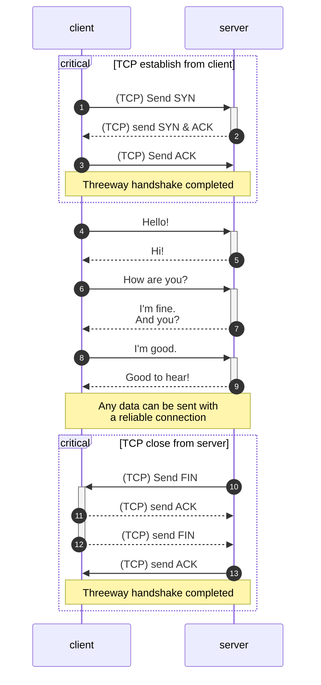

Transmission Control Protocol (TCP) is one of the core protocols of the
Internet Protocol Suite. TCP provides reliable, ordered, and error-checked
delivery of content between two endpoints. It is the backbone of the Internet
and is used by many applications like web browsing, email, and file transfer.

{/* EXCERPT */}

# Introduction

TCP is one of the standard network protocols that define our modern Internet.
85% of total Internet traffic is TCP traffic[^1], while the rest is UDP traffic.
It was developed in the 1970s by
[Vint Cerf](https://www.internethalloffame.org/vint-cerf/) and
[Robert Kahn](https://www.internethalloffame.org/inductee/robert-kahn/)
to buildd a reliable client-server communication using
[packet-switching](https://ethw.org/Packet_Switching).

> Packet switching is a method of data transmission in which data is broken into
> small packets and sent over a network. Instead of establishing a dedicated
> connection line between two hosts, packet switching allows smaller packets to
> be sent independently on multiple routes and reassembled at the destination.

TCP is a connection-oriented, reliable, and stream-oriented protocol. It
provides many mechanisms to ensure the reliability of data transmission such as
error detection, retransmission, duplication, flow controls and congestion
controls.

Most of TCP applications are web-based applications like HTTP (HTTP/1.1 and
HTTP/2), HTTPS, FTP and SMTP, which are basically the protocols that run servers
and applications used by billions of people globally.

# What is TCP?

TCP is a protocol in the Transport Layer of the Internet Protocol Suite. The job
of the Transport Layer is to provide a logical communication between _application processes_. Transport Layer is implemented on top of the Network
Layer and below the Application Layer.

TCP and UDP are the two most common transport protocols. They are both
implemented by the operating systems in the endpoint devices such as computers,
smartphones, and servers whereas the Network Layer is implemented by the
routers and switches and the Application Layer is implemented by the
applications such as web browsers, and web servers.

> If you are not familiar with the network model, I have a post that explains it
> using a postal service analogy. You can read it
> [here](/blogs/understand-the-network-protocol-stacks-with-analogy).

As mentioned above, TCP is a reliable protocols for transferring data between
two endpoints. But why do we need a reliable protocol? Can we just send the data
and the other end will receive it? Well, it's not the simple. There are
many situations the can cause the data to be lost or corrupted during the
transmission. TCP is designed to handle these situations, ensure that the data is transferred correctly and in the right order.

## Connection-oriented protocol

TCP is a connection-oriented protocol because in order to transfer data, both
endpoints must establish a dedicated communication path before sending or
receiving any data. This is done by a process called
[three-way handshake](https://en.wikipedia.org/wiki/Transmission_Control_Protocol#Connection_establishment).

## Reliable data transfer

## Stream-oriented protocol

# How TCP works

# Implement a TCP client and server

# Conclusion

[^1]: [Design, Modeling, and Implementation of Robust Migration of Stateful Edge Microservices](https://www.researchgate.net/publication/375562820_Design_Modeling_and_Implementation_of_Robust_Migration_of_Stateful_Edge_Microservices)

