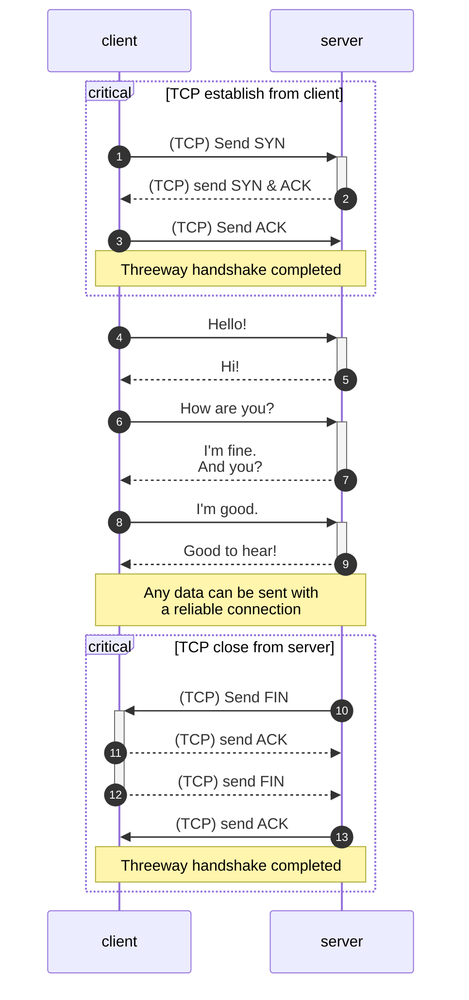
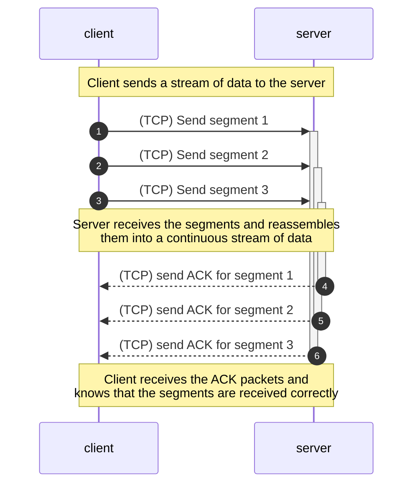

Transmission Control Protocol (TCP) is one of the core protocols of the
Internet Protocol Suite. TCP provides reliable, ordered, and error-checked
delivery of content between two endpoints. It is the backbone of the Internet
and is used by many applications like web browsing, email, and file transfer.

{/* EXCERPT */}

# Introduction

TCP is one of the standard network protocols that define our modern Internet.
85% of total Internet traffic is TCP traffic[^1], while the rest is UDP traffic.
It was developed in the 1970s by
[Vint Cerf](https://www.internethalloffame.org/vint-cerf/) and
[Robert Kahn](https://www.internethalloffame.org/inductee/robert-kahn/)
to buildd a reliable client-server communication using
[packet-switching](https://ethw.org/Packet_Switching).

> Packet switching is a method of data transmission in which data is broken into
> small packets and sent over a network. Instead of establishing a dedicated
> connection line between two hosts, packet switching allows smaller packets to
> be sent independently on multiple routes and reassembled at the destination.

TCP is a connection-oriented, reliable, and stream-oriented protocol. It
provides many mechanisms to ensure the reliability of data transmission such as
error detection, retransmission, duplication, flow controls and congestion
controls.

Most of TCP applications are web-based applications like HTTP (HTTP/1.1 and
HTTP/2), HTTPS, FTP and SMTP, which are basically the protocols that run servers
and applications used by billions of people globally.

# What is TCP?

TCP is a protocol in the Transport Layer of the Internet Protocol Suite. The job
of the Transport Layer is to provide a logical communication between _application processes_. Transport Layer is implemented on top of the Network
Layer and below the Application Layer.

TCP and UDP are the two most common transport protocols. They are both
implemented by the operating systems in the endpoint devices such as computers,
smartphones, and servers whereas the Network Layer is implemented by the
routers and switches and the Application Layer is implemented by the
applications such as web browsers, and web servers.

> If you are not familiar with the network model, I have a post that explains it
> using a postal service analogy. You can read it
> [here](/blogs/understand-the-network-protocol-stacks-with-analogy).

As mentioned above, TCP is a reliable protocols for transferring data between
two endpoints. But why do we need a reliable protocol? Can we just send the data
and the other end will receive it? Well, it's not the simple. There are
many situations the can cause the data to be lost or corrupted during the
transmission. TCP is designed to handle these situations, ensure that the data is transferred correctly and in the right order.

## Connection-oriented protocol

TCP is a connection-oriented protocol because in order to transfer data, both
endpoints must establish a dedicated communication path before sending or
receiving any data. This is done by a process called
[three-way handshake](https://en.wikipedia.org/wiki/Transmission_Control_Protocol#Connection_establishment).

To understand the connection-mode of TCP, you should consider how connectionless
protocols like UDP and IP work. UDP wraps the data in a packet, called
_datagram_, and sends it to the destination without any prior. It follows the
principle of "Fire and Forget". The sender does not care if the packet is
delivered or not. If it needs a response, it will either wait, send another
packet or respond back to the user.

TCP establishes a connection between two endpoints before transferring any data.
This connection will detect data corruption, correct errors and retransmit lost
data. It also ensures that the data is delivered in the same order as it was
sent.

## Reliable data transfer

TCP is built on top of the unreliable IP protocol. IP does not guarantee that
the data is delivered. It follows the principle of "Best Effort", i.e _"I try my
best but I don't promise anything"_. Due to physical factors, data can be
corrupted with bit flipping. And when you move higher to the architecture of the
Internet, data can be lost due to many reasons such as delay, network congestion
or simply the destination is unreachable.

For example, in a busy network, packets can be dropped due to congestion. In the
following figure, packet 1 and packet 3 got transferred successfully but packet
2 got dropped because host D is facing a congestion in its network.

TCP provides many mechanisms to ensure that the data is transferred in whole and
in the right order. Not only that, TCP can detect and control the congestion
in the host and in the network with *flow control* and *congestion control*
mechanisms respectively.

## Stream-oriented protocol

TCP is a stream-oriented protocol. It means that it provides a continuous
stream of data between two endpoints. The data is divided into smaller chunks
called _segments_ and each segment is assigned a sequence number. The receiver
reassembles the segments in the correct order based on the sequence numbers.

For example, if the sender sends three segments with sequence numbers 1, 2 and
3, the receiver will receive them in the same order and reassemble them into
a continuous stream of data. The receiver will also send an acknowledgment
(ACK) packet to the sender to confirm that the segments are received correctly.

The following figure illustrates how TCP provides a continuous stream of data
between two endpoints. The sender sends a stream of data to the receiver and
the receiver reassembles the data into a continuous stream. The sender and
receiver use sequence numbers to keep track of the segments and ensure that
the data is delivered in the right order.

# How TCP works

TCP is a complex protocol because it has to handle many different situations
that can occur during data transmission and cause data loss or corruption. TCP
provides many mechanisms to ensure the reliability of data transmission such as
error detection, retransmission, duplication, flow controls and congestion
controls.

## Error detection

The most basic mechanism of a reliable data transfer (RDT) protocol is the error
detection mechanism. Let's grant that all the data is delivered to the receiver
in the correct order. But how do we know that the data is not corrupted?

There are many factors that can cause the data to be corrupted. It could be a
hardware problem such as faulty network devices, power surge or improper
shutdown. It could also be a software problem due to wrong configuration on the
network stacks, outdated drivers, etc.

TCP uses a checksum to detect errors in the data. This checksum is computed at
the sender side and sent along with the data. The receiver computes the checksum
of the received data and compares it with the checksum sent by the sender. If
the checksums match, the data is considered to be correct. If the checksums do
not match, the data is considered to be corrupted and the receiver will discard
the data.

But here is the tricky part. How should the receiver tell the sender that the
data is corrupted? The sender will be wait for the ACK packet from the receiver
to confirm that the data is received correctly.

The receiver can send a negative acknowledgment (NAK or NACK) packet to the
sender to indicate that an error is detected. The sender will retransmit the
data.

After sending the data, the sender will wait for the response packet from the
receiver. If the sender receives an ACK packet, it means that the data is
received correctly. If the sender receives a NACK packet, it means that the data
is corrupted and the sender will retransmit the data.

However, the NACK mechanism is not used in TCP directly. Instead, the receiver
treats the corrupted data as a packet loss; it will discard the corrupted data.

## Packet loss and Packet retransmission

For every packet that is sent, the send expects an acknowledgment (ACK) packet
from the receiver to confirm that the packet is arrived safely. If the sender
does not receive the ACK packet that matches the sequence number of the sent
packet within a certain time, it will assume that the packet is lost.

TCP uses a time-based retransmission mechanism to retransmit the lost packets.
When a packet is sent, the sender starts a timer. If the timer expires before
the sender receives the ACK packet, it will retransmit the packet.

> From the perspective of Host A, it does not know whether the packet is lost
> before arriving at Host B, the packet gets dropped at Host B, the ACK packet
> from Host B is lost or there is a unusual delay. In all cases, the timer will
> act as a trigger to retransmit the packet.

Simply relying on timers to retransmit can cause unnecessary delay in the
network because the timer is usually set to a high value to avoid false
retransmissions (delayed packets). Fortunately, senders can detect loss packets
before the timer expires by noting the duplicate ACK packets.

When the sender receives a duplicate ACK packet, it means that the receiver has
received the previous packet but not the current one. This is a strong
indication that the current packet is lost. The sender can retransmit the
current packet without waiting for the timer to expire. This technique is called
[Fast Retransmit](https://en.wikipedia.org/wiki/Fast_retransmit).

## Pipe-lineing and out-of-order delivery

## Flow control

## Congestion control

# Implement a TCP client and server

# Conclusion

[^1]: [Design, Modeling, and Implementation of Robust Migration of Stateful Edge Microservices](https://www.researchgate.net/publication/375562820_Design_Modeling_and_Implementation_of_Robust_Migration_of_Stateful_Edge_Microservices)

